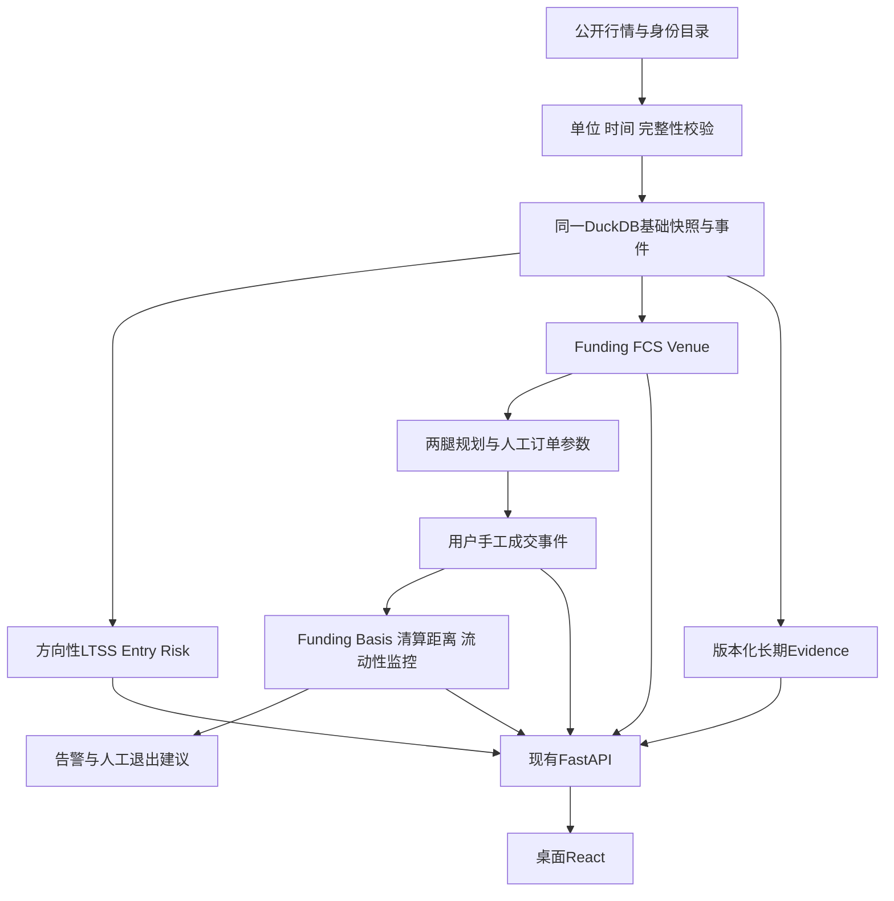

# short-lab 桌面端基础能力完善与资金费对冲一体化设计方案

**版本**：1.0\
**日期**：2026-10-02\
**代码基线**：HEAD `92999cf2f7c2a1491cdd071b68053d2c50cd46c6`，并包含核验时工作区现有未提交修改。\
**适用范围**：Python/FastAPI桌面后端与React桌面UI；Android不开发；不执行交易、不读取交易账户、不接钱包签名。\
**交付目的**：完成现有Short-Lab实际调用链、消除数据与审计缺口，并新增Funding Capture、绝对/相对现货对冲规划、人工订单指引及监控提醒。

## 文档合同

本文为本次开发的统一目标设计。A部分定义实际基线和基础修复，B部分定义资金费对冲业务，C部分定义任务、依赖和验收。开发人员必须同时执行三部分；不能只新增Hedge而绕过单位、持久化、时间和请求预算修复。

现有代码用于确认兼容接口和可复用实现，不能用于覆盖本文明确修正的缺陷。现有方向性评分公式保留，纠正输入单位、缺失字段和配置接线可能改变新计算结果，按版本规则保存；禁止覆盖旧快照。原设计、原实施计划和独立资金费升级文档作为历史来源参考，不作为本次增量开发的并行合同，冲突以本文目标合同为准。本文包含资金费升级的业务内容，不要求开发者另行拼接该文档。

“当前已实现”只描述检查到的代码与离线测试；“必须/目标”描述待实现行为。未实测网络联通、订单执行和收益表现不写成既有能力。“无漏洞”不作为金融风险或上线保证，交付标准为明确合同、覆盖已知问题、可重复验证及明确降级边界。

**阅读顺序**：A1–A3了解基线 → A4–A10完成基础数据闭环 → B3–B25核对数量/现金流/退出 → B28–B40核对存储/API/配置 → C1–C4拆分与验收。

---

# A1. 当前项目与验证范围

## A1.1 产品和代码结构

```text
short-lab/
├── desktop/backend/
│   ├── pyproject.toml              # short-lab-desktop，Python>=3.12
│   ├── short-lab.spec              # PyInstaller onedir
│   ├── src/diveintocrypto_desktop/
│   │   ├── __main__.py             # short-lab / dive-desktop共用入口
│   │   ├── api/app.py              # 单FastAPI、生命周期、静态UI、原API
│   │   ├── api/shortlab.py         # /api/short/*
│   │   ├── data/                  # Binance行情、Funding、OI、Spot、盘口等
│   │   ├── engine/                # 指标/共识/配置；现有指标数学保持
│   │   ├── scan/                  # Scanner、symbol builder、原Evidence
│   │   └── shortlab/
│   │       ├── config.py / default.yaml / models.py
│   │       ├── runtime.py / scheduler.py / service.py / repository.py
│   │       ├── identity/           # 身份resolver和人工override
│   │       ├── providers/          # CoinGecko及FULL provider骨架
│   │       ├── features/ / scoring/ / risk/ / quality.py / entry.py
│   │       ├── evidence/           # 7D/30D/90D grader/metrics
│   │       └── migrations/         # 当前001、002、003
│   └── tests/
├── desktop/ui/
│   ├── src/app/desktop-app.jsx     # 主页面/导航/原有轮询
│   ├── src/app/data.js             # API适配与全局数据通知
│   ├── src/app/shortlab/           # Candidates列表与详情
│   ├── test/                      # Node离线UI测试
│   ├── build.mjs                  # esbuild入口
│   └── dist/                      # 后端实际提供的构建产物
├── tests/                         # 独立根目录测试集
├── .github/workflows/release.yml   # 桌面与Android标签隔离
└── docs/
```

保留Scanner、Panel、Flow、Signal、原Evidence、Compare、Map、Portfolio、Structure、Logs、Settings及60个指标；新增功能在Short Lab内呈现。默认中文，可选TR/EN；默认host127.0.0.1，端口46408。发行名short-lab-desktop、主命令short-lab，保留dive-desktop与diveintocrypto_desktop导入包兼容。

## A1.2 代码基线验证记录（2026-10-02）

| 范围 | 结果 | 可以证明的内容 |
|---|---|---|
| desktop/backend默认离线测试 | 890 passed，6 live deselected | 当前测试定义的行为通过；不证明生产缺失接线可用 |
| 根tests/独立测试集 | 95 passed | 离线API/场景与静态断言通过 |
| desktop/ui Node测试 | 31 passed | 当前UI渲染、适配及静态合同通过 |
| 针对实际函数的离线复现 | 倍率ATH、缺失序列、请求预算和未来时间状态已确认 | 下表缺陷真实存在于实际函数组合 |

后端有1项Starlette/httpx弃用提示，不影响测试结果。没有执行live测试、Windows成品打包或实盘交易。针对调用链的注入数据仅用于离线诊断，没有作为产品数据或live fallback。

## A1.3 开发状态与发布判据

当前工作区只有产品说明、端口及桌面展示等既有修改；F01–F09、H01–H11均为待实施任务，不存在已接入的observations/catalog/hedge/Alpha、schema4/5或新增monitor生产链。下文DDL、接口、配置、工具与测试名称均为目标合同；文档解析、hash复算与DDL验证不能计为业务实现完成。

任务完成必须同时有代码变更、生产调用链、相应测试及CI证据，manifest分别列implementation_status与verification_status。禁止根据设计写了字段、测试mock通过或旧基线测试全绿，把当前代码能力标READY/已完成。本文所列基础缺陷在对应任务交付前继续作为当前限制展示。

## A1.4 功能完成度

| 能力 | 现状 | 目标 |
|---|---|---|
| 原Scanner与技术分析 | 已有API/UI与测试 | 保持公开响应和数学兼容 |
| LITE/FULL纯特征与评分 | 已实现，有边界测试 | 保留分箱和权重；补齐真实输入 |
| 默认身份覆盖 | production candidates为空；override只有1000PEPE/1000SHIB | 真实身份目录与人工验证工作流 |
| Funding历史分页 | adapter已实现 | 持久增量事件、可恢复回填与共享限额 |
| 来源快照 | feature/entry/score已落库；多个基础表无生产写入入口 | 基础表真正写入并可查、可回放 |
| FULL外部数据 | `.example` URL且无默认HTTP fetcher | 未接真实adapter前显式禁用，不能以注册名视为联通 |
| 长期Evidence | grader/metrics已实现；默认任务与metrics provider未接入 | 自动分批到期评估、跨历史样本汇总、UI显示 |
| ShortLab UI | 列表/详情已实现；刷新链路有缺口 | 最新批次发现、固定分页、任务完成后切换 |
| 打包 | spec/release隔离已实现；资源清单不足 | 将所有YAML/SQL资源打包并运行成品smoke |
| Funding/Spot hedge | 尚无对应业务模块 | B部分定义的完整新增链路 |

---

# A2. 已核实问题与改进决策

P0表示可导致错误决策、违反数据可信边界或阻塞发布；P1表示功能闭环缺失/长期可靠性问题。以下结论以实际函数/资源为依据，不以注释中的Task完成宣言为依据。

| ID | 级别 | 实际证据 | 影响与目标修复 |
|---|---|---|---|
| R01 | P0 | `service._build_inputs()`直接取row.price；`ltss.extract_features()`与fundamentals.ath_price相除 | 1000币合约与单币ATH混用；统一canonical价格与USD单位 |
| R02 | P0 | `short-lab.spec`仅显式带shortlab/default.yaml和UI；loader/migrate/overrides读取磁盘YAML/SQL | 成品可能无法读取engine config、迁移SQL或身份表；补资源清单与真实成品启动测试 |
| R03 | P0 | `EntryBudget.guarded()`计factory调用；`http.get_json()`内部已重试 | 预算1可实际发送3次；网络发送尝试与page逐次扣费，移除叠加重试 |
| R04 | P1 | `service.__init__`默认identity_candidates_fn为空；asset_overrides仅2币 | 大多数资产UNRESOLVED，外部基本面/现货无法进入真实评分；补目录与映射接线 |
| R05 | P1 | `_build_inputs.funding_rates_30d=None`；default market未提供oi_change_7d；risk_meta未取已计算price_change_7d | 稳定性、价格/OI组合与7D breakout风险缺输入；使用同一已验证FeatureInputs |
| R06 | P1 | `_build_field_states`将basis/book_depth固定False，即便盘口抓取成功 | DQ和实际指标不一致；按真实数据与双侧盘口构建FieldState |
| R07 | P1 | `quality._freshness_for()`用模块常量；状态函数候选阈值固定60/70；风险阈值及Funding限额多处固定 | YAML修改不完整生效；一次冻结policy贯通service/risk/API/Entry，历史读用当时policy |
| R08 | P0 | pipeline在全量请求前设as_of；数据后来抓取；freshness把负age归0 | 晚于声明决策时点的数据可记为新鲜；明确known_at与decision cutoff，禁止伪造PIT |
| R09 | P1 | 001有asset/mapping/lifecycle/funding/fundamental表，repository无对应生产写入方法 | 表存在不代表有数据，重启失去基础历史与first_seen；补Repository与生产写链 |
| R10 | P1 | `_fetch_funding`每轮重抓90D；超batch直接为空；cursor只在内存 | 回填尾部长期无数据、新代覆盖旧可用值、重启从头；独立持久增量回填 |
| R11 | P1 | runtime只注册score_refresh；metrics_provider默认None | 长期Evidence summary默认503；接grader及metrics，补详情/历史UI |
| R12 | P1 | `evidence.metrics.summary()`默认仅latest generation | 最新得分往往未到7D，历史到期结果不会成为默认研究样本；跨SUCCEEDED历史窗口汇总 |
| R13 | P1 | `_execute_pipeline`只迭代live universe，不联合已见/有仓资产 | 退市资产无法继续出风险/证据状态；独立tracked set与生命周期更新 |
| R14 | P1 | UI首次锁generation；doRefresh仅POST后马上fetch旧gen；DIVE未暴露job status；App轮询global但组件body独立 | 手动刷新不能可靠显示新批次；实现任务轮询与明确换代提示 |
| R15 | P1 | FULL providers `_fetch_payload`无fetcher即失败；runtime仍可按enabled/key注册并选择FULL | “注册成功”与真实可用混淆；真实adapter验收前禁用，能力与健康分离 |
| R16 | P1 | EntryBudget每轮创建新cache；_score_symbol串行抓日线/现货/盘口；repository无retention job | 配置TTL不跨轮兑现、重复重采与数据增长；共享缓存/限并发和安全维护任务 |
| R17 | P1 | `build_symbol(end_ms)`仍读当前OI/ratio/funding尾部 | 历史技术视图可能混入live序列；无法截止的块显式historical unavailable，ShortLab始终快照回放 |
| R18 | P1 | 高频Monitor/API/手工成交未实现；原CORS只允GET/POST | 新PATCH跨源可能失败；同源优先、显式PATCH与本地写请求校验 |

**量纲复现**：native perp price=0.006、multiplier=1000、canonical ATH=0.000012。当前路径得到drawdown=499（49,900%），canonical路径应为-0.5（-50%）。0.006是合约原生报价，不能直接与单币ATH比较。

**预算复现**：EntryBudget(max_calls=1)包住当前HTTP重试函数，模拟连续429产生3次send，而used_calls=1。改进验收必须在最终HTTP send层计数，不只检查上层调用次数。

**配置复现边界**：当前future fetched timestamp被标FRESH；新policy需单测未来known_at无效。上述测试均为离线调用，没有改变产品代码。

---

# A3. 统一架构与产品边界



- 保留一个FastAPI、一个事件循环调度器、一个DuckDB串行worker；不新增Redis/Celery/交易守护进程。
- 不调用订单/账户/持仓私有接口，不处理钱包密钥/签名/approve/swap广播；数据获取失败不切mock。
- 方向性风险、Funding机会readiness、规划状态、真实手工仓位状态、监控健康与退出建议分开。
- 数据目录复用shortlab/paths.py：源码backend/runtime，成品使用各系统用户数据目录或SHORTLAB_DATA_DIR；资源目录只读。
- 同进程新增文件可以拆分域服务，但“禁止第二服务”不等于所有功能塞入service.py。公开service协调，纯计算保持独立可注入。

---

# A4. 统一数据与Point-in-time合同

## A4.1 DataObservation

采用 `shortlab/observations.py` 的 `ObservationMeta` 与 `Observed[T]` 包装器；现有ProviderResult和data客户端公开返回类型保留，不全量重写旧DTO。新领域计算消费Observed，旧调用方经 `to_legacy()` 取得原类型，转换不丢失原status/reason/data，不把未知源时间补为当前时刻。以下字段属于包装元数据：

```text
status: OK | PARTIAL | NOT_APPLICABLE | UNAVAILABLE | ERROR
source / source_schema_version / reason_code
source_as_of_ms: 源数据代表的时间，可null
fetched_at_ms: 本地完成收到响应的时间
known_at_ms: 本系统首次可使用该观测的时间
window_start_ms / window_end_ms / complete / coverage_fraction
units: {price_unit, qty_unit, quote_asset, fx_source, multiplier_source}
identity_snapshot_id / raw_snapshot_id / data
```

F02首先覆盖Funding/Kline/OI/Spot四条数据链，以适配函数包装旧结果；F03在HTTP响应完成处记录接收证据，F06把现有CoinGecko、Entry ratios及mark的关键输入接到该证据链。其他未验证legacy provider保持旧路径并标LEGACY_PROVENANCE_UNKNOWN。能够证明本次接收时间仅表示VERIFIED_INGEST，不等于源窗口完整；只有适配器验证源字段后才标VERIFIED_SOURCE。历史legacy记录不因包装获得新证据，未知关键字段不能READY。包装器须有旧客户端返回类型不变与新领域metadata完整的双向合同测试。

HTTP错误不生成N/A；N/A需市场不存在或业务不适用的可信证明。fundamentals使用coingecko_id，Spot使用已验证spot symbol，链上使用chain_id+精确地址。F04提供唯一 `normalize_chain_address(chain_id,address)`：EVM验证20-byte十六进制，混合大小写按EIP-55校验（使用经过验证的Ethereum Keccak库，禁止NIST SHA3替代），比较键为小写而display保留checksum；全小写输入允许但注明未带checksum。Solana验证base58解码32 bytes并原样保留大小写。未知链不执行lower，返回ADDRESS_CHAIN_UNSUPPORTED。resolver的contract_pair/conflicts/人工override及Venue mapper统一调用，service不对contract_address或平台provider ID调用lower；futures symbol可upper，canonical ID按其目录定义处理。identity/chain/address原值与规范化值都保存，大小写冲突不得降级成symbol匹配。

非Funding历史覆盖不能临时发明新的算法：基础DQ沿用valid_count/required_count和默认字段份额；HedgeDQ按B38。资金费历史分开保存抓取完整性、事件密度异常与现金流mark覆盖，不能把三者混为同一个完整标志。

## A4.2 量纲与时间

1. 原生期货price与qty保留，canonical_price=native_price/m，canonical_qty=native_qty×m；价格PnL两套单位各自一致，不交叉重复乘倍率。
2. MC/FDV/ATH为USD则市场价格先换USD再比较；USDT名义金额单列。新Hedge不得假定稳定币永远1美元；基础LTSS无可信FX时跨币种因子缺失。
3. 模块所需日线为已收盘完整UTC日，qv读raw index7；滚动24h ticker只作轻筛/显示。缺日前后的30D期现比不能求差错位。
4. 对同币种trend百分比可使用原生price比值；ATH、Basis、跨Venue价格必须canonical一致。
5. B3–B5的数量在API/事件保存为Decimal字符串，分析投影可DOUBLE。合法规则来自真实exchangeInfo filters，不能把pricePrecision/quantityPrecision当tick/step。

## A4.3 决策截止与批次

generation具有started_at/finished_at和批次ID，不以started_at冒充所有资产的决策时刻。每个资产收集并冻结输入后，设该资产decision_as_of_ms；Entry与LTSS来源观测均须known_at<=该截止。进入Entry时可以扩充该资产输入包并把决策截止推进到完成冻结的时间；评分使用冻结的同一包重算后一次保存，不给已保存历史快照改时间。

批次中每币decision_as_of允许不同，API分别展示row.asOf与generation.finishedAt。日线窗口使用该币冻结日界；跨日需重新对齐两端，否则不可用。缓存返回原source_as_of/known_at，不用cache命中时间刷新其新鲜度。

未来known_at、源时间明显超过本地接收时间（默认允许2秒时钟偏差）必须标CLOCK_SKEW并禁止READY。旧快照来源不能追溯的字段标LEGACY_PROVENANCE_UNKNOWN；只提供当时存值，不用今天数据“修正历史”。

---

# A5. 方向性特征、状态与配置完善

## A5.1 输入合同修复

`service._build_inputs()`输出冻结FeatureInputs，具体修改：

- current_price/ath_price统一canonical USD；日线closes/highs注明原生单位，趋势按比值无需缩放。
- funding_rates_30d来自当期完整30D窗口，按时间升序，窗口范围和边界统一；原LTSS稳定性保留原事件标准差分箱，FCS用B6的8h等效统计，两个字段分名保存。
- oi_change_7d使用完整可对齐OI历史首末观测：`last_oi_usd/first_oi_usd-1`；两端与价格窗口同一UTC cutoff，误差容许一个5m周期。窗口缺点不伪装0。
- price_change_7d在FeatureInputs中只计算一次，_build_risk_meta使用相同结果；24h滚动涨幅保持既有风险规则，注明它不是Tradeability日成交额。
- _build_field_states按真实Basis结果、双側盘口状态生成；深度missing side为PARTIAL/UNAVAILABLE，不用双边总量充数；basis因无现货市场N/A须有market existence证明。
- 逐因子暴露value/score/status/reason/source与窗口，允许第三方追溯原始证据。

## A5.2 保留数学

保留现有features/scoring各分箱、FULL valuation_raw10+unlock_raw15合成raw25、Narrative raw15、各profile权重和ROUND_HALF_UP一位小数；原版纯函数golden不变。缺失关键输入仍LTSS=null；非关键缺失不重新分配评分权重。FCS和HedgeDQ独立，不改变Existing Consensus。

原方向性Entry六项上限30/20/20/10/10/10与映射保持，六项缺失仍entry=null。原双状态字段、BLOCK优先、MEDIUM禁止READY保留。配置watch_ltss/candidate_ltss/ready_ltss与veto阈值通过显式参数贯通，默认60/70/80等保持；不采用全局可变常量承载用户配置。

## A5.3 QualityPolicy与版本

`quality.data_quality(tier,states,as_of,policy=None)`增加可选冻结policy；None仅用于历史v1默认复现。policy包含组内份额、字段所需数量、TTL/grace和关键字段集。默认fraction×freshness公式不改（freshness=1/0.5/0）；API、service和Entry读取同一policy，移除业务调用对散落默认常量的依赖。未来时间不以age=0纠正。

新输入生产路径标features-v2；Entry观测/预算合同标entry-v2。LTSS数学版本仍ltss-lite-v1/ltss-full-v1（公式不改），保存feature_version明确数据语义差异；新DQ存quality-policy-v2和冻结config policy。统计必须按feature/Entry/quality/cost版本分组，默认不能把旧错误输入样本与修复后样本混合。

历史score/config_hash只读。运行时记录config快照；原hash输入集合保持兼容，新增Hedge采用独立hash，运行/身份/FX/预算等新policy另存policy_hash。缺当时配置不能宣称重算成功，返回REPLAY_CONFIG_UNAVAILABLE。

---

# A6. 持久存储、身份与Funding回填

## A6.1 基础存储闭环

复用已有001表，增加async Repository方法：

```text
upsert_asset / upsert_asset_mapping
save_identity_snapshot / get_identity_snapshot
save_contract_rules_snapshot(record) / get_contract_rules_snapshot(snapshot_id) / latest_contract_rules(symbol, cutoff_ms)
save_contract_lifecycle / latest_contract_lifecycle / list_tracked_symbols
upsert_funding_events / list_funding_events / save_funding_observation
save_fundamental_snapshot / get_fundamental_before
save_config_snapshot / get_config_snapshot
save_cursor / load_cursor
list_scores_for_evidence / list_due_scores
maintain_retention(policy, now_ms, limit=1000)
```

所有方法走同一worker；业务层不绕过worker连接。Asset/mapping当前投影可更新，identity_snapshot不可变；fundamental/contract采样与事件真实入库后再引用其ID。Funding事件冲突内容不同必须保留observed版本和冲突原因，不能UPDATE抹掉历史；旧v1事件主表只保留canonical公共事件索引，新观测由004表保存。

`first_seen_ms`为本地首次见到的时间，重启从DB恢复最早值；onboard缺失时不得当作上市时间。tracked set=live universe∪DB历史有分数资产∪未关闭Hedge资产；历史资产不进入新建订单候选，但继续查生命周期、告警和Evidence。仅从当期live列表消失不能判定退市。

## A6.2 004_core_completion.sql 最小DDL

001–003文件不可修改。004建立冻结policy/身份/元数据/观察版本/可恢复游标与必要索引：

```sql
CREATE TABLE IF NOT EXISTS sl_config_snapshot (
  policy_hash VARCHAR PRIMARY KEY,
  config_hash VARCHAR NOT NULL,
  policy_version VARCHAR NOT NULL,
  canonical_json VARCHAR NOT NULL,
  created_at_ms BIGINT NOT NULL
);
CREATE TABLE IF NOT EXISTS sl_identity_snapshot (
  identity_snapshot_id VARCHAR PRIMARY KEY,
  futures_symbol VARCHAR NOT NULL,
  canonical_id VARCHAR NOT NULL,
  mapping_version VARCHAR NOT NULL,
  observed_at_ms BIGINT NOT NULL,
  identity_json VARCHAR NOT NULL
);
CREATE TABLE IF NOT EXISTS sl_contract_rules_snapshot (
  snapshot_id VARCHAR PRIMARY KEY,
  symbol VARCHAR NOT NULL,
  source_as_of_ms BIGINT,
  known_at_ms BIGINT NOT NULL,
  rules_json VARCHAR NOT NULL
);
CREATE TABLE IF NOT EXISTS sl_funding_observation (
  observation_id VARCHAR PRIMARY KEY,
  symbol VARCHAR NOT NULL,
  funding_time_ms BIGINT NOT NULL,
  known_at_ms BIGINT NOT NULL,
  raw_json VARCHAR NOT NULL,
  interval_hours DOUBLE,
  interval_source VARCHAR,
  observation_status VARCHAR NOT NULL
);
CREATE TABLE IF NOT EXISTS sl_data_cursor (
  job_type VARCHAR NOT NULL,
  cursor_key VARCHAR NOT NULL,
  cursor_json VARCHAR NOT NULL,
  updated_at_ms BIGINT NOT NULL,
  PRIMARY KEY(job_type, cursor_key)
);
CREATE INDEX IF NOT EXISTS idx_sl_identity_time
ON sl_identity_snapshot(futures_symbol, observed_at_ms);
CREATE INDEX IF NOT EXISTS idx_sl_rules_time
ON sl_contract_rules_snapshot(symbol, known_at_ms);
CREATE INDEX IF NOT EXISTS idx_sl_funding_observation_time
ON sl_funding_observation(symbol, funding_time_ms, known_at_ms);
CREATE INDEX IF NOT EXISTS idx_sl_contract_seen
ON sl_contract_lifecycle(futures_symbol, observed_at_ms);
CREATE INDEX IF NOT EXISTS idx_sl_fundamental_asset_time
ON sl_fundamental_snapshot(canonical_id, as_of_ms);
CREATE INDEX IF NOT EXISTS idx_sl_evidence_score_time
ON sl_score_snapshot(as_of_ms, symbol);
```

feature.source_meta_json增加`_policy`、`_identity_snapshot_id`和各source引用，score经feature继承关联；新增键不替换现有字段名。未来新增表/列继续005/006顺序迁移。schema_target与MIGRATIONS/SCHEMA_VERSION同步维护；默认基础目标4，启用Hedge存储目标5。基础目标4会顺序创建旧002/003空表，不意味着FULL已启用；schema与provider能力分开。每个迁移文件完整放在一个DDL事务，所有表、索引与sl_schema_version版本行共同提交；005禁止拆成多个独立提交段。005失败完整回滚并保持schema4和基础服务可用，禁用所有Hedge读写；不能留下部分表却报version5。下一次启动从完整005重新执行。大DDL事务按故障注入实测控制耗时，不用部分提交绕过原子性。

## A6.3 身份目录

身份目录采用三层来源：

1. 发行资源 `identity/verified_assets.yaml` 保存已人工验证的普通1x与1000币测试集、canonical/provider IDs、chain/address、multiplier来源与版本；与现有override的重复项必须一致。启动先加载本地验证集，不等待网络大目录。
2. CoinGecko `/coins/list?include_platform=false` 的id/symbol/name全量目录后台一次拉取，持久缓存24h；只对绑定资产/shortlist最多50币通过已有coins/{id}数据缓存补platform/address，按共享provider限额轮转，不每天强制拉全量include_platform=true。Demo固定api.coingecko.com+x-cg-demo-api-key，Pro固定pro-api.coingecko.com+x-cg-pro-api-key；由api_plan选择，绝不把同一key向另一host发送。初始使用DEMO；无key仅本地已验证集可用，网络目录标UNCONFIGURED，不要求用户为基础Spot功能采购商业方案。
3. 用户overlay来自SHORTLAB_IDENTITY_OVERRIDES_PATH，优先于内置映射，但必须通过相同schema和chain验证；与内置冲突记录来源和版本，不偷偷覆盖历史。

目录HTTP总超时30秒、展开后响应上限32MiB，schema检查完成后原子替换缓存；429按Retry-After退避并保存next_allowed_at，不在启动或UI请求中重试整目录。失败保留此前checksum/known_at；TTL24h、grace72h内可展示带STALE的候选，不能把过期目录新产生的身份标验证通过。人工验证集/有效overlay有独立验证时间，不因目录不可达被清空。目录条目数量从实际响应记录，不使用固定“15k”容量假设。

目录只提供候选；优先人工override、可信chain+contract映射，再唯一精确symbol候选，冲突保留UNRESOLVED。fixture包含重名币、同symbol不同chain和无地址项，禁止为了覆盖500币批量猜ID或倍率。

默认override YAML资源只读；用户人工补充用SHORTLAB_IDENTITY_OVERRIDES_PATH，追加在原配置providers之外的identity子树。文件位于用户指定数据目录，版本和checksum保存到DB；overlay同币与内置冲突显示来源优先级和变化，变化只影响新快照。语法错令身份能力不可用，不隐式忽略成空目录。

FULL只有经过真实provider的HTTP请求/返回schema/身份/时间/cost限额合同验证后可用。禁止`.example`或no-fetcher注册为具备能力；未选实际商业provider时保持enabled=false并展示UNCONFIGURED。瞬时429不把FULL历史改成LITE，只降数据状态；没有验证过的adapter能力时请求FULL降为LITE并说明。

## A6.4 Funding增量与公平性

funding_backfill每300秒唤醒，最多80次真实历史/page/fundingInfo尝试每300秒共享预算（以配置为上限，不能大于上游允许窗口）。回填80个symbol不等于80页；page、429 retry逐次扣款。网络失败保存剩余队列与next_allowed_at，不阻塞score_refresh。

首次抓90D并存DB；之后从last_event_time重叠1个结算周期抓增量、校验去重、周期检查缺口。已缓存完整窗口在TTL内可消费，不能因为本轮未获回填额度改成空；TTL后按原DQ新鲜度降级。缺口任务优先于已完整重复回填，游标持久化且从尾部公平轮转；工作区/进程重启可恢复。

公开Funding interval/cap/floor新采样与nextFundingTime保留；旧24h完整性规则用于v1复现，新Hedge还按B6检查interval异常和mark现金流完整性。禁止用当前interval回填过去所有结算。

---

# A7. 网络预算、缓存与调度

## A7.1 最终发送层预算

`data/http.get_json(..., request_context=None)`用additive参数显式传递，内部ContextVar为保留旧调用签名的请求链提供上下文，跨线程通过copy_context传播，退出作用域复原。`shortlab/request_budget.py`定义 `try_acquire(host,weight,job_type,endpoint_family)->Permit|Denied`，无await地原子预留各预算，最终send才记sent；send前取消只释放reserved，已经sent不返还。每次最终send前申请额度，重试和分页同样申请；不足抛明确BudgetExhausted，等待/排队由调度层处理。Entry移除第二层retry循环，guarded只处理cache/结果，不二次扣同一send。

请求数、交易所request weight、special funding/OI-ratio窗口预算分开计算；不能以连接池24个连接代替rate limit。保留ratio/OI共享40次/60秒保护并计真实重试。所有原scan/Entry/基础回填/Hedge公共请求共享host限额，给原Scanner保留配额；取消请求后不返还已经实际发出的额度。

预算实施分两步：先删除Entry第二层retry而保留HTTP唯一retry，再把分页/重试逐次send接入同一个RequestBudget，禁止删除已有HTTP退避后裸发。F03维护 `endpoint_weights` 版本化清单：Futures public、Spot public、Funding专用窗口、OI/ratios专用窗口分别验证；Alpha/0x使用独立host limiter。每个已使用endpoint与limit参数必须有明确weight fixture，缺weight的请求为UNBUDGETED_ENDPOINT，不允许发出。exchangeInfo.rateLimits决定host窗口上限，不能单凭其数据推断每endpoint权重；endpoint权重来自官方合同与固定fixture。

调度优先级为active monitor/critical账本、用户Scanner、Entry、background backfill、retention；host可用额度默认20%保留monitor、30%保留Scanner，剩余50%供背景请求，高优先级可用未使用额度，背景任务不能耗尽保留量。专用Funding/OI窗口仍分别受原上限保护，不因priority绕过限额；持续容量不足明确排队和degraded，不追加隐形预算。

10币Entry轻量冷路径理想18个叶调用/币约180次；Funding分页及重试增加send数，硬上限240**实际发送尝试**，超过留待下轮。30币理想540次，在默认240预算下必须返回部分Entry并明确queued，不能自动把预算扩大到700。监控按active symbol/venue去重，同一mark供多个plan共享。

## A7.1.1 预算测算与边界

| 工作负载 | 理想叶调用/页数 | 限额约束与真实验收 |
|---|---:|---|
| Entry 10币，冷缓存、Funding每币1页 | 10×(12 Kline+1 OI+4 ratios+1 funding)=180 | 最终send≤240；分页/retry额外扣，不能把180视为含所有重试的上界 |
| Entry 30币，同条件 | 540 | 240硬上限下部分排队；queued symbols可恢复，不扩大默认预算 |
| Funding 500币90D，均8h结算 | 500×ceil(270/1000)=500页 | 80尝试/300秒至少7批，首次批可立即发时6个等待窗口约30分钟，另加网络/退避/元数据费用 |
| Funding 500币90D，均1h结算 | 500×ceil(2160/1000)=1500页 | 至少19批，18个等待窗口约90分钟；事件数与页数来自实际数据 |

这些是无失败/无其他任务竞争的预算下界，不是交付耗时承诺；精确满页后的终止确认也算请求。每job记录logical_calls、pages、sent_attempts、retries、weight_used、queue_remaining、next_allowed_at、duration_ms。测试用真实客户端加fake HTTP发送点，而不是mock掉funding_history_range后检查外层调用次数；必须覆盖budget1、budget240、连续429、跨页取消、两个并发job和重启公平轮转。

## A7.2 缓存与并发

缓存归service/runtime长期对象，不归每轮EntryBudget；cache key包含symbol、endpoint、参数窗口、身份版本与请求数量，quote key还含venue/quantity/direction/FX。EntryBudget仍每轮重置计数。Source timestamps随cache保留；引用需满足decision cutoff，不将cache今天值用于昨天回放。

基础market workers最多4币并行，Entry最多2币并行且共用最终send budget；CPU指标计算使用现有to_thread；后台批次定期yield。500币评分消费来源缓存，盘口/Spot深数据采集在独立公平队列按额度更新，shortlist50提高采样优先级而非永久排除其余资产，Entry仅top10。首次基础数据未完成的资产额外标analysisCoverage=INCOMPLETE及具体原因，不能把“未采集”解释成资产质量已判差；仍保留原null/status字段供兼容消费。后续刷新不能因本轮未采集把可用缓存清空。

## A7.2.1 单worker任务队列

Repository保持一个DuckDB连接和worker线程，队列默认容量256个待执行操作，由ingestion.db_queue_limit控制；hedge.runtime.db_queue_limit必须等于该同一容量，启用时不匹配配置拒绝，禁止建立第二个Hedge队列连接。容量256不同于retention每事务最多1000条记录。队列满返回HTTP503、error/reason_code精确为LOCAL_WRITE_BUSY，不提交事务也不返回成功。提交通过有界优先队列：critical ledger/alert=0，用户查询=1，来源/score=2，backfill=3，retention=4；同优先级FIFO，每等待30秒提升一档避免长期饥饿。单worker不能中断已执行事务，所以score在队列外准备全部row，提交时仅做批量写；维护每事务最多1000项，必须覆盖100/500币和10活跃计划混合负载测试。

Monitor热路径使用内存中的不可变plan/position/latest-market镜像；启动一次从DB恢复，成功账本事务后更新镜像，不每10秒查全量DB。网络抓取/纯计算在event loop独立task中进行，不持有DuckDB worker；分页之间yield、后台任务不得同步CPU阻塞主循环。

Monitor快照写入按plan合并，只保留未写队列中最新一项；默认排队5秒未完成标PERSISTENCE_LAG并degraded，不能静默丢告警或成交。成交/alert写不可丢弃：未提交请求不返回成功，队列满503 LOCAL_WRITE_BUSY，可用同client ID重试。内存产生的未持久alert显示persistence=PENDING，浏览器送达不等于写入成功。持仓状态不因DB排队改为CLOSED/INVALID。

## A7.3 任务注册与互斥

| job | 默认周期 | 行为 |
|---|---:|---|
| identity_catalog_refresh | 86400秒 | 冻结目录/规则，启动可用缓存先加载 |
| contract_refresh | 1800秒 | 更新live+tracked metadata并落库 |
| funding_backfill | 300秒 | 可恢复增量/缺口页队列，80次共享窗口 |
| score_refresh | 1800秒 | 消费缓存、分批输入冻结、原子提交完整代 |
| entry_refresh | 3600秒 | 作为score_refresh的到期子阶段，不另开同币双算 |
| forward_grader | 21600秒 | 扫跨历史到期样本，批次上限100、API配额不足可暂停 |
| retention | 86400秒 | 事务化分批维护，保护引用和证据 |
| funding_capture_refresh/hedge_venue_refresh | B30 | 增量共享基础数据 |
| active monitor | B30 | 无300秒jitter，高频任务只针对有仓位计划 |

普通任务jitter默认0..300秒；资金费结算前检查/active monitor jitter=0，不能共用原高抖动周期。所有入口按job_type共享互斥槽；相同任务并发请求202复用现有job。停机取消并等待所有service后台任务与scheduler后再关闭DB/session；重启将遗留RUNNING标INTERRUPTED（API兼容映射FAILED，reason=PROCESS_INTERRUPTED），cursor恢复剩余工作。

---

# A8. 长期Evidence与历史功能

runtime注册真实grader回调并注入build_metrics_provider，不能只在单测中注入。读取已保存feature/score/Entry，禁止用现有build_symbol(end_ms)重算历史Entry。到期扫描使用repository.list_due_scores，按due_ms、symbol、score ID排序；未到期PENDING，缺价格/Funding/markUNAVAILABLE，可靠终止CENSORED，完整才COMPLETE。

默认metrics汇总过去180天已SUCCEEDED批次的历史样本，query start_ms/end_ms/generation_id/feature_version/entry_version/cost_config_hash/formula_version；显式generation过滤保留旧能力。默认版本为当前版本，旧版本可单选，不默默混合。未分级不一律PENDING：到期但未处理reason=NOT_GRADED_DUE，状态UNAVAILABLE并报告队列数；总计始终含全部样本，不排除退市/缺失资产。

默认实验单位每symbol/profile/UTC日一个预先冻结代表score，选该日最早满足该策略资格的决策；qualifying规则保存策略版本；一整天无资格不生成可交易样本。研究页另列全部原始snapshot统计，不把每半小时高度相关样本当独立试验。默认展示四状态计数、平均净收益及成本/版本，不输出未验证胜率保证。

Grader继续已有price short return+settled mark-weight carry-cost公式，完整1h entry/exit规则与MAE/MFE边界保持；用户真实对冲Evidence另存B28的sl_hedge_outcome。Hedge historical quotes不足就UNAVAILABLE，不取未来quote补入场。

UI ShortLab增加Evidence子页与详情的对应outcomes，包括PENDING/CENSORED/UNAVAILABLE原因。旧原Evidence 1h/4h/24h完全独立；同名接口不得互换。

旧symbol_builder历史视图对无法截止的OI/ratio/funding/micro块返回HISTORICAL_INPUT_UNAVAILABLE；K线指标仍可计算。要恢复完整历史必须存历史输入或验证具历史截止能力的adapter，不能沿用当前序列。

---

# A9. API、UI、发布与维护

## A9.1 页面刷新与接口

ShortLabView负责自身请求状态，不同时由App和页面两套轮询写同一query。分页锁定generation，但顶部周期询问latestGeneration；新批次到达显示“有新数据”，用户切换或手动刷新任务SUCCEEDED后重置offset并切新generation。手动刷新提供DIVE.shortRefreshStatus(jobId)，2秒轮询至完成/失败/超时，不能把POST返回当作已完成。

详情固定对应generation与feature ID；返回列表保留页码。Promise响应使用AbortController或request序号拒绝过期响应；live poll更新React state，不能仅修改window.SGS_SHORT。筛选更新重置offset与generation；failed fetch保留旧数据但明确stale/error。

接口变更均additive；原candidates响应字段、状态及错误保留。health额外输出capabilities、jobs、schema_version、lastSuccessfulGeneration/known missing dependencies，不用available=true暗示每一provider正常。证据和新增Hedge的sort固定NULLS LAST + symbol/ID tie-breaker。

## A9.2 本地写请求

默认同源UI，无跨源preflight；受支持的跨源开发场景CORS仅允许`http://localhost:<port>`或`http://127.0.0.1:<port>`的完整Origin，允许GET/POST/PATCH及所需Content-Type/本地CSRF header，不设置通配allow_origin。PATCH preflight单测必须验证OPTIONS返回允许方法；同源PATCH不因现有allow_methods配置失败。新增plan/fill/ack等写操作校验Origin/Host与JSON Content-Type，跨网站拒绝；无Origin的本地CLI可允许localhost连接。网络部署需用户显式配置，不默认为局域网暴露。所有输入有限数值校验、enum与数量边界；错误中不回传provider credential/URL secret。

`POST hedge/plans`携带simulation_id + client_request_id，冻结所用simulation版本，报价过期则409 QUOTE_EXPIRED要求重算。API只返回已验证字段，其他使用null+reason。PATCH事件要求client_event_id/expected_plan_version；重复请求返回既有结果，冲突409；不得写出负余额或close超量。

## A9.3 打包和资源清单

short-lab.spec明确收集：engine/config/default.yaml、shortlab/default.yaml、identity/asset_overrides.yaml、identity/verified_assets.yaml、migrations/001–005.sql、所有只读目录/adapter fixture中运行必需的资源、UI dist与DuckDB原生库。fixture仅测试用途无需进成品。运行资源统一 `importlib.resources.files("diveintocrypto_desktop")` 经 `resources.py` 读取文本；_MEIPASS仅作成品测试覆盖的后备路径，engine/loader/config/repository/overrides统一调用同一resolver，F09接管这些只读资源调用点，不改各域计算，不从开发机绝对路径读。

成品验收分阶段：F09基础门槛使用schema4，查engine/identity/health及基础评分、第二次启动恢复基础快照，不要求尚未交付的005/Hedge；H01/H08完成后H11最终门槛必须升级schema5、生成/登记/恢复Hedge计划，并第二次启动验证数量/告警持久。两阶段均从只读安装目录和项目内临时用户数据目录启动，不能为让F09通过提前造占位Hedge表。Windows实机或CI成品smoke必须通过：测试从临时只读安装目录启动真实exe，所有fixture通过受控本地public HTTP stub提供，成品运行代码不得切demo/mock；与实网联通验收分开。逐项检查engine YAML、两套身份YAML、全部迁移SQL可读取和schema目标；第二次启动不得借开发checkout查找资源。不能用对spec文本的grep代替。默认源码测试不写用户外部数据路径。

所有默认启动示例、__main__.py docstring、spec说明和release提示统一127.0.0.1:46408；显式--port仍允许用户配置。F09在test_shortlab_packaging.py通过AST检查argparse默认值46408，并检查发行提示/默认示例，不以注释证明运行时端口。更名CLI argparser/banner、FastAPI title、UI package description等产品面为short-lab，保留导入/兼容alias。release.yml保留short-lab-v*仅桌面、v*仅Android的条件，Android源不改。构建资源与版本核对在Task发布验收统一执行。

## A9.4 保留与降级

retention默认分钟monitor30天、小时365天再日级；基础feature/score/Entry原始快照至少180天，关联90D未到期/未完成outcome、活跃plan、未解决alert、配置与身份版本受引用保护，不删除。原Funding事件增量长期保留以支持90D回填；原始深度短缓存，Evidence引用的quote长期保留。每次清理最多1000项，写事务串行，不VACUUM式阻塞主服务；展示DB大小/维护时间。

基础迁移失败令ShortLab及Hedge unavailable，原Scanner独立可用；Hedge005失败在基础004正常时只禁新增Hedge。不完整来源必须保持null/状态，不用“默认安全”。监控中断和quote过期有明确横幅，浏览器关闭不保证后台还在运行。

---

# A10. 配置与可复算性

现有默认配置逐字作为基础默认值，新增配置采用同一shortlab根下严格已知键deep merge；下列代码块是基线配置，不表示新能力已接线。B40定义Hedge新增子树。

```yaml
shortlab:
  enabled: true
  analysis_tier: LITE

  universe:
    limit: 500
    shortlist_size: 50
    entry_depth_top: 10

  candidate:
    watch_ltss: 60
    candidate_ltss: 70
    ready_ltss: 80
    ready_entry: 70
    ready_data_quality: 80
    ready_tradeability_score: 7
    entry_required_blocks: [consensus, mtf, micro, regime, failed_bounce, funding]

  score_weights:
    MEME_LITE: {lifecycle: 40, carry: 45, valuation: 5, tradeability: 10}
    GENERAL_LITE: {lifecycle: 35, carry: 40, valuation: 15, tradeability: 10}
    LOW_FLOAT_VC_LITE: {lifecycle: 25, carry: 30, valuation: 35, tradeability: 10}
    # FULL 的 valuation 键表示 Valuation/Supply 合成模块 raw25
    MEME_FULL: {lifecycle: 30, carry: 35, valuation: 5, narrative: 20, tradeability: 10}
    GENERAL_FULL: {lifecycle: 25, carry: 30, valuation: 20, narrative: 15, tradeability: 10}
    LOW_FLOAT_VC_FULL: {lifecycle: 20, carry: 25, valuation: 35, narrative: 10, tradeability: 10}

  quality_freshness_sec:
    market_futures: {ttl: 900, grace: 3600}
    funding_history: {ttl: 1800, grace: 7200}
    fundamentals: {ttl: 3600, grace: 21600}
    spot_liquidity: {ttl: 3600, grace: 10800}
    identity_profile: {ttl: 86400, grace: 259200}
    unlock: {ttl: 43200, grace: 129600}
    social: {ttl: 10800, grace: 43200}
    catalyst: {ttl: 1800, grace: 7200}

  quality_field_overrides_sec:
    supply_float: {ttl: 21600, grace: 43200}

  liquidity:
    hard_min_futures_volume_usd: 10000000
    hard_min_open_interest_usd: 2000000
    preferred_futures_volume_usd: 30000000
    preferred_open_interest_usd: 5000000

  lifecycle:
    ideal_ath_drawdown_min: 0.40
    ideal_ath_drawdown_max: 0.70

  funding:
    lookbacks_days: [7, 30, 90]
    history_requests_per_5min: 80
    backfill_symbols_per_batch: 80

  evidence_cost:
    entry_fee: 0.0005
    exit_fee: 0.0005
    entry_slippage: 0.001
    exit_slippage: 0.001

  veto:
    breakout_24h: 0.35
    breakout_7d: 0.70
    new_token_days: 45

  refresh:
    fundamental_sec: 3600
    supply_sec: 21600
    score_sec: 1800
    entry_sec: 3600
    grader_sec: 21600
    jitter_sec: 300
    entry_concurrency: 2
    entry_max_upstream_calls_per_run: 240
    entry_cache_ttl_sec: 3600

  providers:
    coingecko:
      enabled: true
      api_key_env: DIVE_COINGECKO_API_KEY
    unlock:
      enabled: false
      api_key_env: DIVE_TOKENOMIST_API_KEY
    social:
      enabled: false
      api_key_env: DIVE_LUNARCRUSH_API_KEY
    catalyst:
      enabled: false
      api_key_env: null
```

基础新增键固定如下（与上面的shortlab根深合并）：

```yaml
shortlab:
  identity:
    catalog_ttl_sec: 86400
    overrides_path_env: SHORTLAB_IDENTITY_OVERRIDES_PATH
    catalog_grace_sec: 259200
    catalog_include_platform: false
    catalog_max_bytes: 33554432
    platform_detail_batch_size: 50
  ingestion:
    market_concurrency: 4
    max_source_future_skew_sec: 2
    contract_refresh_sec: 1800
    funding_backfill_sec: 300
    funding_repair_overlap_intervals: 1
    monitor_reserved_fraction: 0.2
    scanner_reserved_fraction: 0.3
    db_queue_limit: 256
    db_persist_timeout_sec: 5
    db_priority_aging_sec: 30
  evidence:
    default_history_days: 180
    grader_batch_size: 100
    sample_policy: first_eligible_per_symbol_profile_utc_day
  maintenance:
    retention_sec: 86400
    snapshot_min_days: 180
    batch_delete_limit: 1000
  providers:
    coingecko:
      api_plan: DEMO
```

新增值不能嵌进代码成为第二默认来源。validation检查层级、类型、有限数值、TTL/grace、阈值次序、预算可用上限和配置引用。旧LTSS config_hash golden保持；新policy完整canonical JSON保存SHA256，代码hash算法禁止NaN、UTF-8、不带尾换行，golden向量在test_shortlab_config.py。env仅用密钥名称/路径引用，不入评分hash，不落日志。

---

# B1. 资金费对冲产品定位

三个研究入口：Directional Short（LTSS+Entry，方向收益）；Funding Capture（同数量永续空+现货多，近似Delta Neutral）；Hedged Short（部分现货多，保留残余净空头）。它们复用A部分基础数据、身份和存储，但评分与执行Gate独立。

推荐先接Binance Spot，再Alpha，最后具体链上只读报价。链上adapter缺配置不能阻断Spot流程；当前买卖quote不保证未来流动性。资产级FCS不是赚钱概率，Plan Safety不是账户清算保证。实际成交、强平和资金费到账只由用户登记；平台条件单能力明确显示。

一比一指同一canonical token数量；不要求现金投入、保证金或原生报价数量相等。现货盈利不会自动补合约保证金；正Funding会反转。不能将“爆仓后卖现货”作为实现无损的正常路径。只在平台内配置真实保护订单、软件运行/网络/用户响应都具备时，提醒才有实际帮助。

---

# B2. 强制架构边界

## B2.1 MUST：继续单体架构

本次扩展继续运行在：

```text
desktop/backend/src/diveintocrypto_desktop/
```

同一个 FastAPI 进程中。禁止新增：

- 第二个 FastAPI / uvicorn；
- Celery、Redis、PostgreSQL；
- 独立 Hedge Service；
- 第二端口；
- 独立交易守护进程。

启动方式仍为：

```bash
uv run short-lab
```

`uv run dive-desktop` 兼容入口继续保留。

## B2.2 MUST NOT：项目不执行交易

禁止实现：

```text
Binance private order API
Binance account/position API
Wallet private key / seed phrase
Wallet signature
ERC20 approve
DEX swap transaction broadcast
自动开仓 / 平仓 / 补保证金
自动止盈止损
```

允许实现：

```text
公共行情读取
只读报价和深度
现货市场发现
链上只读 quote
数量/价格/成本计算
人工下单指引
用户手工录入真实成交
风险监控与提醒
```

## B2.3 MUST：禁止“无风险/无损/保证收益”文案

1:1 对冲只能称为：

- Delta-Neutral；
- 近似价格中性；
- 完全数量对冲。

原因：仍存在 Basis、强平路径、Funding 反转、两腿成交差、手续费、滑点、Gas、退出流动性、退市和 provider 风险。

---

# B3. Canonical Quantity 与 Hedge Ratio

所有 Hedge 计算必须以 canonical underlying quantity 为核心。

已有 `AssetIdentity.contract_multiplier` 继续作为倍率安全边界。倍率只能来自交易所明确元数据或人工验证 override，不能根据 `1000PEPE` 名称猜测。

```text
canonical_futures_qty
  = futures_contract_qty × contract_multiplier
```

例：

```text
1000PEPEUSDT
contract_multiplier = 1000
futures qty = 100

canonical_futures_qty = 100,000 PEPE
```

以下字段若本来就是 USD/USDT 名义金额，禁止乘除 multiplier：

```text
OI USD
quote volume
market cap
notional USD
```

Hedge Ratio：

```text
h = spot_canonical_qty / futures_canonical_qty
```

残余净空头：

```text
residual_short_ratio = 1 - h
residual_short_qty
  = futures_canonical_qty - spot_canonical_qty
```

API/UI 必须同时显示：

```text
Target Hedge Ratio
Actual Hedge Ratio
Residual Short %
Residual Short Qty
Residual Short Notional
```

---

# B4. 两种对冲模式

## B4.1 ABSOLUTE

```text
h = 1.0
Perp Short Canonical Qty = Q
Spot Long Canonical Qty  = Q
```

目标：尽可能抵消资产价格方向风险，使主要收益来源转为 Funding 与 Basis 变化。

价格腿：

```text
FuturesPnL = Q × (Pf_entry - Pf_now)
SpotPnL    = Q × (Ps_now - Ps_entry)

PricePnL =
  Q × [(Pf_entry - Ps_entry)
     - (Pf_now - Ps_now)]
# Pf/Ps为同一计价币的canonical单币价格；不直接使用合约原生报价
```

所以 ABSOLUTE 并非严格 PnL=0，残余来自 Basis、成交时间差、rounding、fee/slippage 和 liquidation path。

## B4.2 RELATIVE

```text
0 < h < 1
```

例：

```text
Futures Short = $10,000 equivalent
Target Hedge Ratio = 60%
Spot Long ≈ $6,000 equivalent
Residual net short ≈ $4,000 equivalent
```

近似方向 PnL：

```text
DirectionalPnL
≈ -(1 - h) × FuturesNotional × PriceReturn
```

Funding按每次结算时实际持有空腿的mark名义金额产生，与现货对冲比例无关；现货投入额应按quantity×spot price计算，不能直接用h×期货金额替代。

---

# B5. Relative Hedge 风险预算反推

用户不应只能凭感觉填 `30% / 50% / 70%`。

输入：

```text
Futures Notional N
Stress Up Move S
Max Allowed Directional Loss L
```

最低对冲比例：

```text
h_min = 1 - L / (N × S)
h_target = clamp(h_min, 0, 1)
# 若结果为 0 或 1，分别提示无对冲方向性方案或 ABSOLUTE，须用户按对应mode重新提交，不得伪称 RELATIVE
```

例：

```text
N = $10,000
S = +100% = 1.0
L = $2,000

h_min = 80%
```

UI 支持两种互斥输入：

1. 直接指定 Hedge Ratio；
2. 输入 Stress Up Move + Max Loss，由系统反推。

两种模式同时提交返回 `422`。`S` 使用小数（100%=1.0），要求 `S>0`、`L>=0`、`N>0`。该反推只覆盖共同价格上涨的方向损失，不包括 Basis、成本、强平或退出失败损失；总损失预算另保留这些项的缓冲。

---

# B6. Funding Capture Entry Gate

Funding 数据必须复用既有：

```text
data/funding.py
sl_funding_event + sl_funding_observation
7D / 30D / 90D coverage
```

必须区分：

```text
lastSettledFundingRate
currentFundingRate / predictedFunding
nextFundingTime
funding7d
funding30d
funding90d
positiveFundingRatio30d
positiveFundingRatio90d
fundingStd30d
longestNegativeStreak30d
```

`predicted/current funding` 不是已锁定收益。

默认配置：

```yaml
funding_capture:
  entry_gate:
    require_current_positive: true
    require_last_settled_positive: true
    min_funding_7d: 0.0
    min_funding_30d: 0.0
    min_positive_ratio_30d: 0.75
    min_positive_ratio_90d: 0.60
    min_30d_coverage: 0.90
    min_90d_coverage: 0.80
```

规则：

```text
current <= 0
→ NOT_READY_FUNDING_NOT_POSITIVE

last settled <= 0
→ NOT_READY_LAST_SETTLED_NOT_POSITIVE

30D cumulative <= 0
→ NOT_READY_CARRY_30D_NON_POSITIVE

30D positive ratio < 75%
→ NOT_READY_FUNDING_PERSISTENCE

coverage 不足
→ NOT_READY_FUNDING_COVERAGE
```

资产有可靠上市时间且未满 90D 时，90D 可为 `NOT_APPLICABLE/INSUFFICIENT_ASSET_AGE`，但 30D 仍必须满足完整 gate。未知上市日期或抓取不足不得用资产年龄不足掩盖缺失。7D累计必须严格大于配置门槛；90D适用时，其 coverage 与正费率比例同样必须通过，否则 NOT_READY。非正当前费率不得新建 READY 计划。

---

## B6.1 Funding 统计与结算口径

窗口固定为 `(as_of_ms-D×86400000, as_of_ms]` 的已结算事件，按 `(symbol,fundingTime)` 去重、升序；当前期 rate 不插入历史。必须复用历史抓取完整性判定：`complete=false` 时，窗口累计/比例/标准差不得伪装成可用值，即便 coverage_fraction 达到门槛。既有 coverage 规则不变；本模块增加 interval 元数据和间隔异常提示，不假设每个币每天恒定结算三次。

`fundingDd=sum(rate)` 是固定名义规模的简单历史费率和，不是账户实际收益。正费率比例为 `count(rate>0)/event_count`，0不算正；负费率连续次数只统计连续 `<0`，0中断序列。FCS 的 `fundingStd30d` 使用结算事件的 8h 等效费率 `rate×8/interval_hours` 的总体标准差（ddof=0）；interval来自当时保存的元数据或可验证相邻事件间隔，无法确认则该指标缺失并使 FCS=null。8h 等效只用于稳定性比较，不改变现金流与累计费率。

滚动7D APR：每个完整 UTC 日结束时计算此前完整7D窗口，窗口结束不得晚于 as_of；30D/90D 内只保留完整有效窗口，P25采用排序后线性插值 `index=(n-1)×0.25`，要求分别至少20/60个窗口。不足时保守 APR=null、NOT_READY，不外推缺口。APR 是**相对于期货名义金额的历史简单年化**。另输出 `capital_at_risk=spot_buy_cash+futures_margin+cost_reserve` 和按该投入计算的情景收益率，避免把高杠杆保证金收益率误当低风险资产收益率。

必须新增每合约 Funding interval/cap/floor 与 nextFundingTime 快照，并共享既有历史请求限额；当前 interval 不能用于重写过去全部事件。结算前10分钟开始每30秒复核当前费率与时间，翻负立即提醒；此复核仅在后端运行、网络正常时有效。临近结算的开平仓不得认定必然拿到当期 Funding，需标 `SETTLEMENT_BOUNDARY_UNCERTAIN`。

---

# B7. Funding 退出规则

默认：

```yaml
funding_capture:
  exit:
    negative_settlement_streak: 2
    weakening_7d_vs_30d_ratio: 0.30
```

```text
current funding <= 0
→ WARN_FUNDING_TURNED_NON_POSITIVE

连续 2 次 settled funding < 0
→ EXIT_FUNDING_NEGATIVE_STREAK

7D average daily funding <
30D average daily funding × 30%
→ WARN_FUNDING_WEAKENING
```

若保守预期 Funding 已不足以覆盖退出成本：

```text
EXIT_FUNDING_EDGE_GONE
```

持有判断使用从现在起的增量收益和退出风险，不因未收回入场成本强迫继续持有。`planned_hold_days` 已到期或用户剩余计划时长内保守 Funding 小于预计退出成本时给出退出建议；时长缺失仅提示评估不足，不自行推断用户持有期限。


# B8. Funding Capture Score（FCS）

## B8.1 定位与版本

`FCS` 与 `LTSS`、`Entry` 完全独立：

```text
LTSS  → 长期方向性空头价值
Entry → 当前方向性做空时机
FCS   → Funding Capture 适配度
```

禁止：

- 将 FCS 合并进 LTSS；
- 用 FCS 改 Existing Consensus；
- 用 Entry 作为 ABSOLUTE Funding Hedge 的硬门槛。

首版：

```text
fcs_version = "fcs_v1"
```

任何改变历史分数的数学改动必须升级版本。

## B8.2 Reference Notional

资产级 FCS 用固定参考规模评估现货可执行性：

```yaml
funding_capture:
  reference_notional_usd: 10000
```

FCS 表示：

> 在约 $10,000 参考规模下，该资产是否适合 Funding Capture。

真实用户计划必须再计算 `Plan Safety Score`。

## B8.3 精确评分

总分 100：

| 模块 | 分值 |
|---|---:|
| Funding Yield | 25 |
| Funding Persistence | 25 |
| Funding Stability | 15 |
| Hedge Venue Quality | 15 |
| Basis Quality | 10 |
| Operational / Contract Safety | 10 |

### Funding Yield：25

使用已结算 30D cumulative funding：

| 30D Funding | 分 |
|---:|---:|
| >= 4.0% | 25 |
| >= 2.5% | 20 |
| >= 1.5% | 15 |
| >= 0.75% | 8 |
| > 0 | 3 |
| <=0 / unavailable | 0 |

coverage 不足时，本模块 `unavailable`，整个 FCS=`null`；禁止把缺失权重重新分配。

### Funding Persistence：25

30D Positive Ratio：15 分：

| Ratio | 分 |
|---:|---:|
| >=90% | 15 |
| >=80% | 12 |
| >=75% | 9 |
| >=65% | 5 |
| <65% | 0 |

90D Positive Ratio：10 分：

| Ratio | 分 |
|---:|---:|
| >=90% | 10 |
| >=80% | 8 |
| >=70% | 5 |
| >=60% | 2 |
| <60% | 0 |

若资产年龄不足 90D，90D 为 N/A，不重分 10 分；保留0..100固定尺度，该子项贡献0但状态是 N/A，满分上限90；UI 显示 `FCS_PARTIAL_HISTORY` 和 available_max_score。所有适用项缺失均令 FCS=null，不能用0代替未知。

### Funding Stability：15

`fundingStd30d`：8 分：

| Std | 分 |
|---:|---:|
| <=0.0003 | 8 |
| <=0.0008 | 5 |
| <=0.0015 | 2 |
| >0.0015 | 0 |

`longestNegativeStreak30d`：7 分：

| 连续负结算次数 | 分 |
|---:|---:|
| 0 | 7 |
| 1 | 6 |
| 2 | 3 |
| 3 | 1 |
| >3 | 0 |

### Hedge Venue Quality：15

基于 `reference_notional_usd` 的最佳已验证 Venue。

双向可执行：7 分：

```text
buy >= reference 且 sell >= reference → 7
两边 >= reference×0.75 且未到reference → 4
两边 >= reference×0.50 且未到reference×0.75 → 2
否则 → 0
```

Roundtrip execution cost：5 分：

```text
<=0.30% → 5
<=0.60% → 3
<=1.00% → 1
>1.00% → 0
```

Exit feasibility：3 分：

```text
CONFIRMED → 3
PARTIAL   → 1
UNKNOWN/NO → 0
```

### Basis Quality：10

```text
0 <= b <= 0.005       → 10
0.005 < b <= 0.015    → 8
0.015 < b <= 0.030    → 5
b > 0.030            → 2
-0.005 <= b < 0      → 3
b < -0.005           → 0
```

这里只表示当前入场 Basis 质量，不代表 Basis 必然收敛。

### Operational / Contract Safety：10

```text
Futures status TRADING           2
No confirmed delisting           2
Identity VERIFIED/HIGH           2
Multiplier verified              2
Spot quote fresh                 1
Next funding time known          1
```

BLOCK 风险优先于 FCS。FCS 是确定性的规则评分，不是赚钱概率；高正 Basis 分数仅表示入场结构假设，极高正 Basis 仍必须进行扩大压力测试与强平预警。Venue Quality 基于现货原始双向报价，roundtrip成本包括该现货Venue买卖费用/Gas/滑点，不含期货腿；机会列表总体成本则包含两腿，字段分别命名避免混淆。

---

## B8.4 分布核验与评分解释

B8分箱是固定规则模型的默认值，不是已验证的收益预测模型。H03在网络接线启用前保存真实Funding原始dump，样本至少50个有完整90D记录的合约并覆盖不同实际结算间隔，另含至少10个可靠上市年龄30..89D的样本；数量不足记录实际n与缺失原因，不以合成数据补足实证样本。按历史区间冻结输入，在同一cutoff计算7D/30D/90D、等效std、P25及coverage，输出每个分箱n、分位数、直方图及NOT_READY原因分布。

原始dump只由F03/F06受限队列采集；离线报告不再联网。报告用途是发现实现/数据退化、暴露几乎全部null/同分的情况，不以观察到的收益挑阈值或自动优化。H03同时交默认分箱golden和真实分布证据，FCS功能未完成此验收保持enabled=false；数学实验可在离线fixture测试中执行。未来改变阈值须新fcs_version和新hash，旧结果不可覆盖。

90D年龄不足固定 `historyClass=PARTIAL_90D`、availableMaxScore=90、missingReason=INSUFFICIENT_ASSET_AGE，分数仍按固定0..100轴显示，不乘100/90。完整历史为FULL_90D、上限100；适用但缺覆盖FCS=null。UI显示两类差异，Evidence默认分组比较，不把分数解释成成功概率。显式FCS排序为数字ASC/DESC、NULLS LAST、symbol ASC、snapshotId ASC，不能按可用满分归一后偷偷改变排序。

---

# B9. Spot Venue Resolver

## B9.1 支持三类 Venue

```text
BINANCE_SPOT
BINANCE_ALPHA
ONCHAIN_DEX
```

统一业务接口，不允许在 Planner/Monitor 中散落大量 venue-specific 分支。

建议目录：

```text
shortlab/hedge/venues/
├── base.py
├── binance_spot.py
├── binance_alpha.py
└── onchain.py
```

## B9.2 SpotVenueQuote DTO

本DTO的symbol为venue instrument ID，不是canonical身份。mid/VWAP统一返回每个canonical token的USD价格，同时quote JSON保留native价格/币种/汇率/qty输入。buy/sell executable qty是在最大price impact内可覆盖的canonical数量；仅ticker不能产生这两个字段。ProviderResult继续沿用现有DTO，不新增一套错误外壳。

```python
@dataclass(frozen=True)
class SpotVenueQuote:
    venue: str
    canonical_id: str
    symbol: str | None
    chain: str | None
    contract_address: str | None

    as_of_ms: int
    expires_at_ms: int | None

    reference_notional_usd: float

    mid_price: float | None
    buy_vwap: float | None
    sell_vwap: float | None

    buy_executable_qty: str | None  # Decimal字符串
    sell_executable_qty: str | None  # Decimal字符串

    buy_slippage_bps: float | None
    sell_slippage_bps: float | None

    estimated_fee_usd: float | None
    estimated_gas_usd: float | None
    direction_costs: dict  # buy/sell fees, gas, price impact included flags

    entry_feasible: bool
    exit_feasible: bool
    exit_feasibility: str  # CONFIRMED | PARTIAL | UNKNOWN | NO
    quote_currency: str
    quote_to_usd: float | None
    source_timestamp_ms: int | None
    fetched_at_ms: int
    requested_canonical_qty: str  # Decimal字符串
    trading_rules: dict
    capabilities: dict

    identity_confidence: str
    status: str
    reason_code: str | None
```

所有 quantity 都是 canonical token quantity。

## B9.3 Venue 排名

不能简单硬编码：

```text
Binance Spot > Alpha > Onchain
```

默认排序依据：

1. identity verified；
2. 可买；
3. 两种模式均必须可卖；
4. 能覆盖目标 quantity；
5. roundtrip cost；
6. sell-side exit depth；
7. quote freshness。

API 返回所有 Venue，同时标记 `bestVenue`。先筛出满足身份、双向全量、有效报价的Venue，再按roundtrip成本升序、退出容量降序、时间降序、venue ID升序稳定排序。部分对冲仍需要退出全部所持现货，不能放宽可卖Gate。卖出报价必须请求买入计划最终取得的同一数量；不能用两次独立10,000美元报价冒充同量回转。

---

# B10. Binance Spot

必须继续复用已有 `data/spot.py`，不得创建重复 Binance Spot client。

Hedge 需要：

- market existence；
- best bid/ask；
- depth；
- reference notional VWAP；
- buy/sell executable quantity；
- spot price；
- normalized basis。

只允许通过：

```text
AssetIdentity.binance_spot_symbol
```

访问。

禁止：

```text
futures_symbol.replace(...)
1000 前缀猜测
```

---

# B11. Binance Alpha

## B11.1 用途

用于：

> Binance Futures 有永续，但 Binance 主 Spot 没有对应市场，而 Binance Alpha 存在现货市场。

必须只使用 Binance Alpha **公共市场数据**，不使用交易/账户接口。

底层 adapter 建议：

```text
data/binance_alpha.py
```

业务包装：

```text
shortlab/hedge/venues/binance_alpha.py
```

## B11.2 至少获取

```text
Token list / identity metadata
Exchange info / trading rules
Current price
24h stats
Kline
Best bid/ask
Depth / full depth（官方接口可用时）
```

Binance 官方 Alpha Trading 已公开 token list、exchange info、Kline、ticker和Full Depth/盘口流，新增adapter采用这些公共端点并保存raw fixture。详见[Alpha公共行情文档](https://developers.binance.com/en/docs/catalog/advanced-trading-alpha-trading/api/rest-api/market-data)。文档存在不代表本地网络实测通过，实施需验证host、参数、限额与地区可用性。Alpha orderbook market与钱包内链上购买分开记录；tokenId与合约地址不能互相推导。

## B11.2.1 公共端点与启用验收

固定host www.binance.com，先获取token list与exchange info，再按返回的合法instrument ID读取ticker/fullDepth；symbol来自映射，不用tokenId猜spot ticker。公共路径为`/bapi/defi/v1/public/wallet-direct/buw/wallet/cex/alpha/all/token/list`与`/bapi/defi/v1/public/alpha-trade/{get-exchange-info,ticker,fullDepth,klines}`。fullDepth limit默认100，不足目标数量可以预算内升级500/1000，但不能据已截断盘口断言更深价格必可成交。

保存原始envelope与字段schema：HTTP200仍检查业务code="000000"及data形状；存在success字段时必须为true。source时间优先depth.E/T，缺失仅记录VERIFIED_INGEST；规则里的filters按真实字段解析，未知orderType或filter拒绝该订单类型规划。451/403=VENUE_REGION_UNAVAILABLE，429=RATE_LIMITED（保留Retry-After），不映射N/A、不绕过地域限制。Alpha未公开/未验证权重时使用独立保守5次/10秒、并发1的host limiter，不借FAPI的额度，响应更新更严限额优先。

tokenList/exchangeInfo缓存30分钟、ticker/depth以B31为准；只有固定raw fixtures加目标部署网络的联网证据均通过后，providers.binance_alpha.enabled才可为true。上线证据记录UTC时间、host、参数、业务code、市场ID及限额配置，剔除敏感信息；不把官网文档可访问当作数据接口联通。

## B11.3 Alpha Identity

Venue identity 固定保存于新增 `sl_hedge_venue_mapping`，不修改旧身份表。字段：

```text
binance_alpha_symbol
binance_alpha_token_id
```

映射同时保存 canonical_id、venue、chain_id、contract_address、decimals、quote_asset、verification_source、verified_at_ms 和 mapping_version；钱包余额不可读取，执行权限和Gas余额由用户自行确认。

如果 Alpha 只有 symbol 且存在多候选：

```text
UNRESOLVED
```

不得作为 ABSOLUTE READY venue。

---

# B12. On-chain Spot

## B12.1 范围

On-chain 仅允许：

```text
read-only quote
liquidity inspection
buy/sell quote
gas/cost estimate
```

不得生成、签名、广播交易。

## B12.2 Provider合同与首个适配器

```python
class OnchainQuoteProvider(Protocol):
    async def quote_buy(self, identity, requested_canonical_qty: str,
                        quote_asset, as_of_ms: int,
                        request_context) -> ProviderResult[OnchainQuote]: ...
    async def quote_sell(self, identity, requested_canonical_qty: str,
                         quote_asset, as_of_ms: int,
                         request_context) -> ProviderResult[OnchainQuote]: ...
    async def health(self, request_context) -> ProviderResult[dict]: ...
```

`OnchainQuote`使用B9公共字段并增加provider_id/api_version/chain_id/block_number/atomic_amounts/decimals/quote_kind=INDICATIVE、gas_units/gas_price/native_gas_fx（可null）、token_tax_status、route_complete、simulation_verified=false；所有raw量为整数原子单位字符串，不用浮点计算10^decimals。

首个链上研究适配器固定Ethereum主网chain_id=1、0x Swap API v2的只读 `/swap/allowance-holder/price`，host为api.0x.org；header使用0x-version=v2与SHORTLAB_0X_API_KEY引用，限额默认1次/秒、并发1，且不超过用户账户实际配额。健康状态由最近一次合法price响应统计，不发未公开health endpoint。其他链/aggregator显式UNAVAILABLE/CHAIN_PROVIDER_UNCONFIGURED，不在本次泛化为多链交易框架。

目标买入量换为token原子单位，buy方向用buyAmount，sell方向用相同净token量的sellAmount；两者不同时发送。quote币种使用已验证的Ethereum USDC映射及decimals，汇率另查；仅当链/地址/decimals均已验证才请求。参数不含taker、recipient、txOrigin或用户钱包，不查询balance/allowance，不请求getQuote、approve、swap或交易calldata；若服务误返回可签名交易数据，schema拒绝且不落库。

该price接口是indicative，Gas/网络费可能null。适配器只能给参考路由/买卖成本，不能把返回值提升为账户可执行证明；缺Gas即cost=null、exit_feasibility=PARTIAL、riskValidation=LIMITED、simulation readiness=NOT_READY，仍允许DRAFT规划/手工记录并显示known costs。provider过期时间若未给，保存expires_at=fetched_at+30秒；定时观测30秒刷新，但计划保存和用户准备下单时必须重新请求同量双向price。不得给不存在的expires字段伪造provider保证。

H05分两项验收：协议+raw fixture合同测试；Ethereum/0x有配置key的受控联网PoC（请求/响应schema、429、gas缺失、路线失败、过期、request数量）。第一项通过只能称接口完成；缺SHORTLAB_0X_API_KEY时adapter不得发网络请求，health返回UNCONFIGURED/CHAIN_PROVIDER_UNCONFIGURED并保持enabled=false；无密钥CI必须实际运行该分支的合同测试，不能仅skip后计PoC通过。H01冻结API/env配置合同，H05负责adapter和缺key逻辑，F04负责地址/checksum，F01先合并eth-hash依赖。没有第二项证据不得启用网络adapter，更不能称多链功能已完成。正式READY仍按B12.3要求，indicative-only能力不能满足其中simulation验证；未来扩大能力必须单独冻结只读验证合同，不在首版悄悄请求交易payload。

H05冻结文档URL、取证时间、API版本与脱敏OpenAPI/response fixture的checksum；官方路径 `evm-ap-is` 原样使用，不按拼写直觉重写为其他URL。URL变化必须核对返回标题/endpoint与schema，不用HTTP200的官网通用首页作为证据。

上述接口及限制来自[0x price API](https://docs.0x.org/api-reference/evm-ap-is/swap/allowanceholder-getprice)与[认证合同](https://docs.0x.org/api-reference/api-overview)，实际联通由H05验证。

## B12.3 ABSOLUTE 硬 Gate

只有同时满足：

```text
BUY quote available
SELL quote available
same verified contract
buy size executable
sell size executable
gas estimate available
price impact below maximum
quote fresh
```

两种模式都执行此Gate。双向 quote 只能验证当前路由报价，不保证未来成交；余额、allowance、交易权限、transfer-tax、sell限制或quote simulation未验证时标 PARTIAL，不能输出已确认可执行。Rebase、fee-on-transfer、冻结/黑名单或资产版本转换不清晰的Token不得进入数量对冲 READY。

才允许：

```text
HEDGE_VENUE_READY
```

否则：

```text
NOT_READY_ONCHAIN_EXIT_UNVERIFIED
```

原因是“可以买”不等于“之后可以卖”。

## B12.4 Contract 验证

必须使用：

```text
chain + contract_address
```

不能只靠 symbol/name。

没有 verified contract：

```text
ONCHAIN = UNAVAILABLE
```

---

# B13. Execution Cost Model

项目不读取用户 VIP 等级，因此手续费只能作为研究假设或用户配置。

```yaml
hedge:
  costs:
    futures_entry_fee_rate: 0.0005
    futures_exit_fee_rate: 0.0005
    spot_entry_fee_rate: 0.001
    spot_exit_fee_rate: 0.001
    alpha_entry_fee_rate: 0.001
    alpha_exit_fee_rate: 0.001
    onchain_extra_buffer_bps: 20
```

计算：

```text
EntryCost =
    FuturesEntryFee
  + SpotEntryFee
  + FuturesEntrySlippage
  + SpotEntrySlippage
  + EntryGas

ExitCost =
    FuturesExitFee
  + SpotExitFee
  + FuturesExitSlippage
  + SpotExitSlippage
  + ExitGas

RoundTripCost = EntryCost + ExitCost
```

费用按各腿自己的原生名义金额与费率计算，再转换到报告币；入场与退出分别计算。buy/sell VWAP若已用作执行价，该价包含的盘口滑点不再扣一次；使用mid作PnL参考时才把VWAP-mid差额列成本。Onchain quote已包含的provider/LP/transfer费用逐项标included，不与spot_entry_fee或extra_buffer重复相加；buffer只覆盖未包含的不确定成本。

输出：

```text
roundTripCostUsd
roundTripCostPctOfFuturesNotional
```

---

# B14. Break-even 与保守 Funding

```text
BreakEvenFundingPct =
  RoundTripCostUsd / FuturesNotionalUsd
```

```text
EstimatedBreakEvenDays =
  BreakEvenFundingPct / (ConservativeAPR / 365)
```

若保守 daily funding <=0：

```text
BreakEvenDays = null
NOT_READY_NO_POSITIVE_CONSERVATIVE_CARRY
```

禁止用 `current funding × 365` 作为主决策值。

必须输出：

```text
HistoricalSimpleAPR7D
HistoricalSimpleAPR30D
HistoricalSimpleAPR90D
ConservativeAPR
```

定义：

```text
APR_30D = funding30d × 365 / 30
APR_90D = funding90d × 365 / 90
```

有足够滚动窗口时：

```text
ConservativeAPR =
  max(0,
      min(APR_30D,
          APR_90D,
          P25Rolling7DAPR90D))
```

若 90D 因资产年龄不足不可用：

```text
ConservativeAPR =
  max(0,
      min(APR_30D,
          P25Rolling7DAPR30D))
```

必须返回：

```text
conservativeAprMethod
historyCoverage
```

---

# B15. Hedge Planner

## B15.1 输入

```python
HedgeSimulationRequest {
    symbol

    mode: ABSOLUTE | RELATIVE

    futures_notional_usd

    # RELATIVE 二选一
    hedge_ratio
    # 或
    stress_up_pct
    max_directional_loss_usd

    preferred_spot_venue: AUTO | BINANCE_SPOT | BINANCE_ALPHA | ONCHAIN_DEX

    futures_leverage
    margin_mode
    margin_usd

    liquidation_price | null
    liquidation_price_source: USER_EXCHANGE | ESTIMATED | NONE
    liquidation_price_updated_at_ms | null
    stop_policy: ALERT_ONLY | USER_PLATFORM_ORDERS
    stop_trigger_price | null
    stop_trigger_basis: MARK_PRICE | CONTRACT_PRICE | null
    maximum_pair_loss_usd | null

    planned_hold_days | null
    fee_overrides | null
}
```

全部输入只接受有限数值：notional>0、leverage>=1、margin>0、fee rate在[0,1)、planned_hold_days为1..365整数或null；ABSOLUTE禁止提交relative ratio/budget，RELATIVE要求明确选择一种输入。margin不足公开交易规则的初始保证金需求时不可READY；不能从这些数值推导账户真实清算价。

## B15.2 输出

```python
HedgeSimulation {
    simulation_id
    generated_at_ms
    expires_at_ms
    symbol
    canonical_id
    mode

    futures_symbol
    futures_price  # native quote/unit，仅展示与原生订单数量计算
    canonical_futures_price_usd
    futures_quote_currency
    quote_to_usd
    futures_notional_usd
    futures_contract_qty
    canonical_futures_qty

    target_hedge_ratio

    spot_venue
    spot_symbol
    spot_chain
    spot_contract
    spot_price
    target_spot_qty
    spot_notional_usd

    residual_short_ratio
    residual_short_qty
    residual_short_notional_usd

    fcs
    plan_safety_score

    funding_metrics
    basis_metrics
    cost_metrics
    break_even

    stress_scenarios[]
    order_guidance[]
    monitoring_capability
    risk_validation: VERIFIED | LIMITED | UNKNOWN
    liquidation_check_status
    risks[]
    warnings[]
    readiness
}
```

---

# B16. Quantity Rounding

计算顺序必须固定：

1. 根据 futures notional 求 futures quantity；
2. 按 futures step size 向下取合法值；
3. 转 canonical futures qty；
4. 根据 target hedge ratio 求 raw spot qty；
5. 按 spot venue step/decimals 向下取合法值；
6. 用最终计划 quantity 重新算 hedge ratio；
7. 检查最小/最大数量、MIN_NOTIONAL/NOTIONAL、PRICE_FILTER及market lot规则；用Decimal计算quantity/price并以十进制字符串传输，下单参数不从DOUBLE反算；
8. rounding drift 超阈值时告警；超过5个百分点不得 READY。ABSOLUTE不足精度不能仍称严格1:1。

默认：

```yaml
hedge:
  ratio:
    drift_warn_pct: 0.02
    drift_critical_pct: 0.05
```

例：

```text
target = 100%
actual = 97%
drift = 3%
→ WARN
```

---

## B16.1 TradingRules冻结合同

统一 `TradingRulesSnapshot(venue,instrument_id,source_as_of_ms,known_at_ms,rule_version,raw_filters,order_types,price_rules,lot_rules,notional_rules)`。tickSize/stepSize/minQty/maxQty/minNotional/maxNotional及市场订单flags均为Decimal字符串，0的禁用含义按该venue官方规则处理，不把0当合法步长。

Futures/Spot/Alpha各自解析真实filters后转同一结构：LIMIT按LOT_SIZE，MARKET优先MARKET_LOT_SIZE且同时满足适用MIN_NOTIONAL/NOTIONAL，价格检查PRICE_FILTER及适用PERCENT_PRICE规则。订单类型不支持或规则未知返回TRADING_RULES_UNVERIFIED，不从precision推测。exchangeInfo缓存30分钟，确认状态变化/用户重算可刷新；保存rules snapshot ID，Planner只能消费该ID对应版本。

H02负责共用 `data/trading_rules.py` parser/cache与三个venue规则fixture；F02仅保留原始Futures filters及时间，不提前另造parser。B16八步顺序逐步断言最终ratio与合法数量，卖出量不超过净现货余额，dust明确登记，首次失败不能靠rounding自动增加用户风险预算。

---

# B17. Stress Simulator

至少输出：

```text
-25%
-50%
+25%
+50%
+100%
```

RELATIVE 额外输出：

```text
+200%
```

每个场景：

```text
spotPnl
futuresPnl
directionalPnl
residualExposurePnl
```

Stress同时输出共同价格冲击、Basis扩大（±1%/±3%）、退出滑点扩大以及期货先平/现货先平的孤腿路径。以当前mark和用户强平价判断路径是否穿过强平：穿过则线性终点PnL标 `INVALID_AFTER_LIQUIDATION`，不得展示为可实现对冲收益。无法验证强平价时输出 `LIQ_PATH_UNKNOWN`。

Stress PnL 不包含未来未知 Funding。可以另列历史 carry 假设，但不能混成“保证结果”。


# B18. Plan Safety Score

FCS 是资产级；`Plan Safety Score` 是具体计划级，必须使用真实目标 notional、目标 hedge ratio 和用户输入的保证金参数。

总分 100：

| 模块 | 分值 |
|---|---:|
| Hedge Ratio / Drift | 20 |
| Liquidation Buffer | 25 |
| Exit Liquidity | 20 |
| Cost / Break-even | 15 |
| Funding Edge | 10 |
| Data Freshness | 10 |

## B18.1 Hedge Ratio / Drift：20

未激活计划：

```text
rounding 后 drift <=1% → 20
<=2% → 15
<=5% → 5
>5% → 0
```

激活后使用 actual hedge ratio。

## B18.2 Liquidation Buffer：25

若没有用户提供可核对且新鲜的交易所界面 liquidation price：

- ESTIMATED有可复算模型时本模块最高10/25；NONE则0分并标UNKNOWN；
- 标记 `LIQ_PRICE_NOT_VERIFIED`。

Short：

```text
liqDistance =
  (liquidationPrice - markPrice) / markPrice
```

| Distance | 分 |
|---:|---:|
| >=50% | 25 |
| >=30% | 20 |
| >=20% | 15 |
| >=10% | 8 |
| >=5% | 2 |
| <5% | 0 |

## B18.3 Exit Liquidity：20

同时检查 Futures 和 Spot：

```text
两腿退出 size 均可在最大 price impact 内完成 → 20
最差一腿仅覆盖 75%~100% → 10
最差一腿 <75% → 0
```

## B18.4 Cost / Break-even：15

```text
Break-even <=2d  → 15
<=5d             → 12
<=10d            → 8
<=20d            → 3
>20d / unavailable → 0
```

## B18.5 Funding Edge：10

```text
全部 Funding Entry Gate 通过 → 10
任一硬 Gate 失败 → 0
# 两种取值，不设未定义的“最低门槛”中间档
```

## B18.6 Data Freshness：10

```text
Futures mark fresh            2
Spot quote fresh              2
Spot exit depth/quote fresh   2
Funding current fresh         2
Contract state fresh          2
```

任一关键字段超过TTL时READY立即降为NOT_READY；TTL..grace可展示带STALE的历史参考，不能绿色READY。超过grace或provider expires_at：

```text
execution readiness = NOT_READY
```

---

# B19. Hedge Plan 与 Actual Fill

## B19.1 Plan 和实际成交必须分开

不得把“计划价/计划数量”当成用户真实仓位。

状态：

```text
DRAFT
READY
PARTIALLY_FILLED
ACTIVE
CLOSING
CLOSED
INVALID
```

## B19.2 用户手工录入实际成交

录入使用不可变事件，而非覆盖平均价：每次事件记录 `event_id/client_event_id/plan_id/leg_type/event_type(OPEN/CLOSE/LIQUIDATION/ADJUSTMENT/FUNDING_RECEIPT)/executed_at_ms/native_qty/canonical_qty/native_price/fee_amount/fee_currency/fee_usd/gas_usd/source(USER_ENTERED)/recorded_at_ms`。client_event_id幂等，plan_version乐观锁冲突返回409；更正以撤销引用和替代事件完成。相同时间的两腿成交按event_id确定聚合顺序，不使用当前余额回填历史。FUNDING_RECEIPT记录用户手工确认的结算时间、金额、币种及引用公共事件ID，不改变quantity；撤销/替代使用ADJUSTMENT并明确被引用事件。

下面是事件聚合后的两腿投影：

Futures leg：

```text
side = SHORT
qty
canonical_qty
avg_entry_price
actual_fee_usd optional
leverage
margin_mode
margin_usd
exchange_liquidation_price optional
opened_at_ms
closed_qty
avg_exit_price
closed_at_ms
```

Spot leg：

```text
side = LONG
venue
qty
canonical_qty
avg_entry_price
actual_fee_usd optional
gas_usd optional
opened_at_ms
closed_qty
avg_exit_price
closed_at_ms
```

## B19.3 ACTIVE Gate

只有用户录入两条腿真实成交、剩余quantity>0且actual ratio与目标偏差不超过5个百分点后才能 ACTIVE。退出建议是独立 `recommended_action`；不据此改写账本持仓状态。INVALID仅限未成交计划失效；已成交计划遇到数据失效保留持仓状态并显示DEGRADED。

只录入一条腿：

```text
PARTIALLY_FILLED
```

并产生：

```text
ORPHAN_LEG_WARNING
```

---

# B20. Manual Execution Guide

项目不下单，但要生成清晰的人工操作指引。

例：

```text
ABSOLUTE 100%

Futures:
  BTWUSDT SHORT
  Qty: 7,000 BTW
  Reference price: 1.425

Spot:
  Binance Alpha
  BUY 7,000 BTW
  Reference price: 1.421

Suggested:
  Execute in paired chunks
  Suggested chunk: 1,000 BTW
```

必须同时显示：

```text
Quote generated at
Quote expires at
Price is reference only
User must place orders manually
```

## B20.1 Paired Chunk

默认执行提示：

```text
PAIR_IN_CHUNKS
```

chunk 上限：

```text
chunkNotional <= min(
  futuresNotionalAtMaxImpact,
  spotNotionalAtMaxImpact,
  config.maxManualChunkUsd
)
```

默认：

```yaml
hedge:
  execution:
    max_price_impact_bps: 30
    max_manual_chunk_usd: 5000
```

系统仅给建议，不自动下单。

---

## B20.2 买卖单与止损单的人工参数指引

每次模拟返回结构化 `order_guidance`：leg、venue、instrument、side、order_type、合法quantity、参考limit_price、trigger_price、trigger_basis、reduce_only_or_close_position、有效期、价格偏离上限和venue capability。仅生成平台操作参数，不生成交易请求或链上交易payload。

| 阶段 | 合约空腿 | 现货多腿 | 注意事项 |
|---|---|---|---|
| 建仓 | SELL开空，数量按合约原生单位 | BUY同资产净数量 | 按成对小批执行；每批人工确认实际成交，未成交前不可当作持仓 |
| 正常平仓 | BUY关闭剩余空仓，核对reduce-only/close position | SELL对应现货剩余数量 | RELATIVE按目标比例关闭，检查实际成交而非挂单状态 |
| 上涨风险保护 | 用户在平台设置BUY止损平空；优先MARK_PRICE触发并确保低于用户录入的强平价 | 支持上涨触发卖出的venue可设置对应SELL条件单；不支持则仅提供人工提醒 | 两个独立条件单无法保证同时成交；现货止损限价/止盈单可能未成交或残留 |
| 下跌方向获利 | RELATIVE按风险预算给出BUY止盈/分批平空参数 | 同批释放对应现货 | ABSOLUTE不单独用期货止盈后保留现货，避免形成裸多 |
| 强平/一腿已平 | 用户确认后登记事件 | 对剩余孤腿给出紧急退出数量/参考价 | 无私有接口不能自动发现真实强平，也无法联动另一平台 |

止损触发价格必须由用户输入或基于其明确最大组合损失/安全缓冲计算，禁止把评分转换成保证不爆仓的价格。空单上行止损满足 `current_mark < stop_trigger < user_liquidation_price`；建议安全缓冲至少5%强平距离并显示当前盘口冲击及手动响应压力，但跳空、触发保护与订单拒绝仍可能越过此价。无用户强平价或该价过期时只输出参考风险价，不输出已验证的强平前保护。

跨Venue现货条件价按当前canonical Basis映射仅作参考，返回basis_as_of和允许偏差，不能把期货MARK_PRICE原数值复制到现货。Alpha/DEX无对应条件单能力时明确 `PLATFORM_STOP_UNSUPPORTED`，提供人工操作步骤并将监控覆盖标为LIMITED。监控软件提醒不替代平台订单。

合约先触发止损后现货单应由用户立即检查和取消/重设；现货先成交后空单成为裸空同样处理。系统保留用户登记的订单参数、设置时间、是否已在平台设置，但未读取平台订单，因此“已设置”只标USER_CONFIRMED，不能称LIVE_VERIFIED。

---

# B21. Pair Exit

正常退出必须强调：

> 两条腿成对关闭。

不能把“期货爆仓后再卖现货”作为常规策略。爆仓后的现货处理只能是 emergency fallback。

RELATIVE按各自剩余数量分批退出；一条腿提前清零应产生孤腿提醒。现货dust必须显示数量和市值，不作为完全对冲持仓。

正常退出流程：

```text
1. 刷新 Futures/Spot 价格与深度
2. 确认 Spot 可退出数量和滑点
3. 按 paired chunks 关闭两腿
4. 用户录入实际 exit fills
5. 两腿各自剩余数量为0（允许明确记录交易规则以内dust）后标 CLOSED；RELATIVE两腿数量本来就不相等，禁止检查两腿closed quantity相等
```

若用户确认 futures 已 liquidation：

```text
FUTURES = CLOSED / LIQUIDATED
SPOT = ACTIVE
→ CRITICAL_ORPHAN_SPOT_LEG
```

若 Spot 已卖但 futures 空仓仍存在：

```text
CRITICAL_ORPHAN_FUTURES_LEG
```

---

# B22. Liquidation Risk Monitor

## B22.1 数据来源

项目不读账户，强平价优先级：

```text
1. USER_EXCHANGE
2. ESTIMATED
3. NONE
```

只有 `USER_EXCHANGE` 可称“用户从交易所界面录入的强平价”，仍不是实时账户验证。每次加减仓/保证金变动必须重新录入，超过24小时标STALE。V1不根据leverage单独推算精确强平价；无maintenance margin tier/费用/账户模式输入时不提供ESTIMATED数值。CROSSED受其他持仓影响，默认仅LIMITED风险检查。

ESTIMATED 必须标注：

```text
Estimate only
```

当mark达到用户强平价，仅提醒 `LIQUIDATION_POSSIBLE_UNCONFIRMED` 并紧急复核，不自动登记LIQUIDATION、不将空腿数量清零。Funding流入、账户手续费、保证金调整均可能改变真实强平价。

## B22.2 Short Liq Distance

```text
liqDistancePct =
  (liqPrice - markPrice) / markPrice
```

默认：

```yaml
hedge:
  liquidation:
    warning_distance: 0.20
    critical_distance: 0.10
    emergency_distance: 0.05
    user_price_max_age_sec: 86400
```

状态：

```text
>=20%  NORMAL
10~20% WARNING
5~10%  CRITICAL
<5%    EMERGENCY
```

CRITICAL：

```text
PAIR_EXIT_RECOMMENDED
```

EMERGENCY：

```text
PAIR_EXIT_URGENT
```

系统必须在接近强平前提醒，而不是等推测已爆仓才第一次提示。

---

# B23. Basis Monitor

统一 canonical price 后：

```text
basisPct =
  (canonicalPerpPrice - spotPrice) / spotPrice
```

保存：

```text
entryBasisPct
currentBasisPct
basisChangePct
basisPnlUsd
```

ABSOLUTE：

```text
basisPnl =
  Q × [(Pf_entry - Ps_entry)
     - (Pf_now - Ps_now)]
```

默认：

```yaml
hedge:
  basis:
    warning_vs_accrued_funding: 0.50
    exit_vs_accrued_funding: 1.00
    warning_min_usd: 10
    warning_min_notional_ratio: 0.001
    exit_min_usd: 20
    exit_min_notional_ratio: 0.002
```

```text
adverseBasisLoss >= max(10 USD, 0.1% of futures entry notional, 50% of max(known settled funding,0))
→ WARN_BASIS_CONSUMING_CARRY

>= max(20 USD, 0.2% of futures entry notional, 100% of max(known settled funding,0))
→ EXIT_BASIS_CONSUMED_CARRY
```

只对 adverse basis 触发；亏损为0不触发。Funding完整累计缺失时使用上述固定金额/名义金额门槛，并标CARRY_COMPARISON_UNAVAILABLE，不凭未知分母展示收益耗尽。

---

# B24. Spot Exit Liquidity Monitor

ACTIVE 计划定期重新评估：

```text
remaining Spot Qty 是否能卖出
estimated exit slippage
estimated gas
```

默认：

```yaml
hedge:
  liquidity_monitor:
    max_exit_slippage_bps: 100
    min_exit_coverage_ratio: 1.0
```

规则：

```text
sell executable qty < remaining spot qty
→ CRITICAL_SPOT_EXIT_CAPACITY

estimated exit slippage > max
→ WARN_SPOT_EXIT_SLIPPAGE
```

On-chain 计划优先级更高。

---

# B25. Hedge Monitor PnL

ACTIVE 计划持续计算：

```text
Spot PnL
Futures PnL
Directional PnL
Basis PnL
Estimated Settled Funding
Known Fees
Estimated Exit Cost
Gas
Net PnL Before Exit
Estimated Net PnL After Exit
```

**Funding Accrued 基于公共已结算事件和用户手工成交时间推算，命名为 `estimatedSettledFundingUsd`；无账户流水不能宣称实际到账。**

每事件现金流：`carry_i=short_native_qty_at_ti × exchange_mark_price_i × settled_rate_i`；负率扣款，native qty和交易所mark直接相乘不重复乘倍率。使用事件账本在当时的剩余空单量，不能拿当前量乘完整历史。缺mark、缺持仓历史或结算边界成交的事件标不确定；完整累计=null，同时另列known subtotal及coverage，禁止补0。用户可手工登记 actual funding receipt 并独立显示，不与估算重复相加。

价格PnL拆分（canonical）：`matched_qty=min(Qf,Qs)`；matched basis PnL 加未匹配期货空腿/现货多腿的方向PnL等于两腿总价格PnL。Basis PnL已经包含在Spot+Futures总PnL中，不得再相加。费用Token扣减现货时净quantity进入ratio；Gas/fee统一计一次，VWAP已含滑点的执行价不得另扣同一滑点。

Funding现金流先得到合约结算币金额，再用该结算时刻FX转换到USD；mark或该时刻FX缺失时USD累计为null。期货价格PnL先按native_qty×(native_entry_price-native_exit_or_mark)得到结算币金额；已实现PnL用成交时FX，未实现PnL用当前FX。Basis拆分公式只在双方使用相同计价币时严格相等，跨币种另列fx_pnl_adjustment，不把币价涨跌与汇率残差混在Basis；汇率缺失不输出完整USD净收益。

Net after exit = realized price PnL + unrealized price PnL + estimated settled carry - known fees/gas - estimated remaining exit cost；原始费用缺失时输出估算标签，任何关键未知使完整净值=null。所有金额显示结算币种与USD转换来源，USDT/USDC不能默认永远等于1美元。

预测 funding 单独显示：

```text
Projected Next Funding
```

不得计入 accrued PnL。

---

# B26. Alerts

至少支持：

```text
FUNDING_TURNED_NON_POSITIVE
FUNDING_NEGATIVE_STREAK
FUNDING_WEAKENING
FUNDING_EDGE_GONE

HEDGE_RATIO_DRIFT
HEDGE_RATIO_CRITICAL

BASIS_CONSUMING_CARRY
BASIS_CONSUMED_CARRY

LIQ_DISTANCE_WARNING
LIQ_DISTANCE_CRITICAL
LIQ_DISTANCE_EMERGENCY

SPOT_EXIT_SLIPPAGE
SPOT_EXIT_CAPACITY

CONTRACT_DELISTING
VENUE_UNAVAILABLE

ORPHAN_FUTURES_LEG
ORPHAN_SPOT_LEG

MANUAL_FILL_STALE
QUOTE_STALE
```

Severity：

```text
INFO
WARN
CRITICAL
```

Alert 生命周期：

```text
OPEN
ACKNOWLEDGED
RESOLVED
```

同一 plan/condition 不能每个 monitor tick 新建 alert。建议 dedup key：

```text
(plan_id, alert_code, leg_type_or_venue)
```

同条件 OPEN/ACKNOWLEDGED 期间更新last_seen/context，不重复创建；RESOLVED后再次触发新episode。条件恢复需连续2个成功且新鲜tick才标RESOLVED；抓取失败不能视为恢复。严重级别和建议动作分离：severity=INFO/WARN/CRITICAL，recommended_action=NONE/REVIEW/PAIR_EXIT/URGENT_PAIR_EXIT，EXIT_RECOMMENDED是动作而非比CRITICAL更高的严重级别。

---

# B27. 浏览器提醒

V1 支持：

```text
Alert Center
UI Toast
Browser Notification
Optional sound
```

浏览器 Notification 必须由用户主动授权。

Email / Telegram / Slack 不作为 V1 前置。

---

# B28. DuckDB 增量设计

基础修复完成后的迁移：

```text
001_init.sql
002_unlock_social.sql
003_catalyst.sql
004_core_completion.sql
```

本次必须新增：

```text
005_hedge_advisor.sql
```

**禁止修改已经执行的迁移；当前已发布001–003，新004/005发布后同样只读。**

## B28.0 数据类型与账本边界

权威输入为simulation.input_json/result_json、plan.plan_config_json中的Decimal字符串以及不可变event_json。所有quantity/price/notional/fee/remaining/dust余额运算只从这些权威值解析Decimal；sl_hedge_plan与sl_hedge_leg的DOUBLE列仅为展示/筛选投影，不得再读回参与账本、合法数量、超量或平仓校验。原始quantity/price/fee数值以十进制字符串保存于事件/quote JSON；源时间、fetch时间、formula/config/mapping版本、引用quote snapshot IDs随plan_config_json固化。sl_hedge_leg是事件聚合投影，不能替代不可变成交表。aggregate_hedge_position返回Decimal字符串的open/closed/remaining/gross/net/weighted-price与引用event IDs；数量余额使用Decimal系数/指数对齐的整数累计（验证过原子单位时使用原子整数），不受Python默认28位context舍入影响。价格/VWAP/PnL计算显式localcontext至少80有效位，舍入只用于分析/显示，不用于数量是否为0/是否超量的判断；禁止SQL SUM(qty)、float比较或DOUBLE投影来校验余额。费用扣量先明确资产单位，dust只能按已冻结规则显式登记，不能用通用epsilon吞掉余额。

005同时创建以下表（均由H01负责，应用层在同一worker事务内维护引用完整性）：

```sql
CREATE TABLE IF NOT EXISTS sl_hedge_simulation_snapshot (
  simulation_id VARCHAR PRIMARY KEY,
  symbol VARCHAR NOT NULL,
  generated_at_ms BIGINT NOT NULL,
  expires_at_ms BIGINT NOT NULL,
  formula_version VARCHAR NOT NULL,
  policy_hash VARCHAR NOT NULL,  -- hedge_policy_hash；包含formula与Safety规则版本
  input_json VARCHAR NOT NULL,
  result_json VARCHAR NOT NULL,
  source_meta_json VARCHAR NOT NULL
);
CREATE TABLE IF NOT EXISTS sl_hedge_venue_mapping (
  mapping_id VARCHAR PRIMARY KEY,
  canonical_id VARCHAR NOT NULL,
  venue VARCHAR NOT NULL,
  instrument_id VARCHAR NOT NULL,
  mapping_version VARCHAR NOT NULL,
  verification_json VARCHAR NOT NULL,
  verified_at_ms BIGINT NOT NULL,
  UNIQUE(canonical_id, venue, instrument_id, mapping_version)
);
CREATE TABLE IF NOT EXISTS sl_hedge_fill_event (
  event_id VARCHAR PRIMARY KEY,
  plan_id VARCHAR NOT NULL,
  client_event_id VARCHAR NOT NULL,
  leg_type VARCHAR NOT NULL,
  event_type VARCHAR NOT NULL,
  executed_at_ms BIGINT NOT NULL,
  recorded_at_ms BIGINT NOT NULL,
  event_json VARCHAR NOT NULL,
  UNIQUE(plan_id, client_event_id)
);
CREATE TABLE IF NOT EXISTS sl_hedge_snapshot_reference (
  referrer_type VARCHAR NOT NULL,
  referrer_id VARCHAR NOT NULL,
  referenced_type VARCHAR NOT NULL,
  referenced_id VARCHAR NOT NULL,
  purpose VARCHAR NOT NULL,
  created_at_ms BIGINT NOT NULL,
  PRIMARY KEY(referrer_type, referrer_id, referenced_type, referenced_id, purpose)
);
CREATE INDEX IF NOT EXISTS idx_sl_hedge_reference_target
ON sl_hedge_snapshot_reference(referenced_type, referenced_id);
CREATE INDEX IF NOT EXISTS idx_sl_hedge_fill_time
ON sl_hedge_fill_event(plan_id, executed_at_ms, event_id);
CREATE TABLE IF NOT EXISTS sl_hedge_outcome (
  outcome_id VARCHAR PRIMARY KEY,
  fcs_snapshot_id VARCHAR NOT NULL,
  strategy VARCHAR NOT NULL,
  horizon_days INTEGER NOT NULL,
  outcome_status VARCHAR NOT NULL,
  reason_code VARCHAR,
  evidence_version VARCHAR NOT NULL,
  cost_config_hash VARCHAR NOT NULL,
  outcome_json VARCHAR NOT NULL,
  updated_at_ms BIGINT NOT NULL,
  UNIQUE(fcs_snapshot_id, strategy, horizon_days, evidence_version, cost_config_hash)
);
```

## B28.1 sl_funding_capture_snapshot

```sql
CREATE TABLE IF NOT EXISTS sl_funding_capture_snapshot (
  snapshot_id VARCHAR PRIMARY KEY,
  symbol VARCHAR NOT NULL,
  canonical_id VARCHAR NOT NULL,
  as_of_ms BIGINT NOT NULL,

  fcs_version VARCHAR NOT NULL,
  fcs_config_hash VARCHAR NOT NULL,
  reference_notional_usd DOUBLE NOT NULL,

  fcs DOUBLE,
  module_scores_json VARCHAR NOT NULL,
  funding_metrics_json VARCHAR NOT NULL,
  venue_summary_json VARCHAR NOT NULL,
  basis_json VARCHAR,
  risk_json VARCHAR NOT NULL,

  readiness VARCHAR NOT NULL,
  reasons_json VARCHAR NOT NULL,

  created_at_ms BIGINT NOT NULL
);

CREATE INDEX IF NOT EXISTS idx_sl_fcs_symbol_time
ON sl_funding_capture_snapshot(symbol, as_of_ms);
```

## B28.2 sl_spot_venue_snapshot

```sql
CREATE TABLE IF NOT EXISTS sl_spot_venue_snapshot (
  snapshot_id VARCHAR PRIMARY KEY,
  canonical_id VARCHAR NOT NULL,
  venue VARCHAR NOT NULL,
  venue_symbol VARCHAR,
  chain VARCHAR,
  contract_address VARCHAR,

  as_of_ms BIGINT NOT NULL,
  fetched_at_ms BIGINT NOT NULL,
  expires_at_ms BIGINT,

  reference_notional_usd DOUBLE NOT NULL,

  quote_json VARCHAR NOT NULL,
  status VARCHAR NOT NULL,
  reason_code VARCHAR
);
```

## B28.3 sl_hedge_plan

```sql
CREATE TABLE IF NOT EXISTS sl_hedge_plan (
  plan_id VARCHAR PRIMARY KEY,

  symbol VARCHAR NOT NULL,
  canonical_id VARCHAR NOT NULL,

  mode VARCHAR NOT NULL,
  status VARCHAR NOT NULL,

  target_hedge_ratio DOUBLE NOT NULL,

  futures_notional_usd DOUBLE NOT NULL,
  futures_contract_qty DOUBLE NOT NULL,
  canonical_futures_qty DOUBLE NOT NULL,

  spot_venue VARCHAR NOT NULL,
  spot_symbol VARCHAR,
  spot_chain VARCHAR,
  spot_contract VARCHAR,

  target_spot_qty DOUBLE NOT NULL,
  target_spot_notional_usd DOUBLE,

  leverage DOUBLE,
  margin_mode VARCHAR,
  margin_usd DOUBLE,

  liquidation_price DOUBLE,
  liquidation_price_source VARCHAR,

  planned_hold_days INTEGER,

  fcs_snapshot_id VARCHAR,
  simulation_id VARCHAR NOT NULL,
  client_request_id VARCHAR NOT NULL UNIQUE,
  plan_safety_score DOUBLE,

  plan_config_json VARCHAR NOT NULL,

  created_at_ms BIGINT NOT NULL,
  activated_at_ms BIGINT,
  closed_at_ms BIGINT,
  updated_at_ms BIGINT NOT NULL,
  plan_version BIGINT NOT NULL DEFAULT 1
);
```

## B28.4 sl_hedge_leg

```sql
CREATE TABLE IF NOT EXISTS sl_hedge_leg (
  leg_id VARCHAR PRIMARY KEY,
  plan_id VARCHAR NOT NULL,

  leg_type VARCHAR NOT NULL,
  venue VARCHAR NOT NULL,
  side VARCHAR NOT NULL,

  qty DOUBLE NOT NULL,
  canonical_qty DOUBLE NOT NULL,
  avg_entry_price DOUBLE,
  actual_fee_usd DOUBLE,
  actual_gas_usd DOUBLE,

  opened_at_ms BIGINT,

  closed_qty DOUBLE NOT NULL DEFAULT 0,
  avg_exit_price DOUBLE,
  exit_fee_usd DOUBLE,
  exit_gas_usd DOUBLE,
  closed_at_ms BIGINT,

  state VARCHAR NOT NULL,
  updated_at_ms BIGINT NOT NULL
);
```

## B28.5 sl_hedge_monitor_snapshot

```sql
CREATE TABLE IF NOT EXISTS sl_hedge_monitor_snapshot (
  snapshot_id VARCHAR PRIMARY KEY,
  plan_id VARCHAR NOT NULL,
  as_of_ms BIGINT NOT NULL,

  actual_hedge_ratio DOUBLE,
  residual_short_notional_usd DOUBLE,

  mark_price DOUBLE,
  spot_price DOUBLE,

  current_basis_pct DOUBLE,
  basis_pnl_usd DOUBLE,

  estimated_settled_funding_usd DOUBLE,
  projected_next_funding_usd DOUBLE,

  spot_pnl_usd DOUBLE,
  futures_pnl_usd DOUBLE,

  known_cost_usd DOUBLE,
  estimated_exit_cost_usd DOUBLE,

  net_pnl_before_exit_usd DOUBLE,
  estimated_net_pnl_after_exit_usd DOUBLE,

  liquidation_distance DOUBLE,

  exit_liquidity_json VARCHAR,
  source_meta_json VARCHAR NOT NULL,
  quality_json VARCHAR NOT NULL,
  metrics_json VARCHAR NOT NULL,
  safety_score DOUBLE,

  status VARCHAR NOT NULL,
  created_at_ms BIGINT NOT NULL
);
```

## B28.6 sl_hedge_alert

```sql
CREATE TABLE IF NOT EXISTS sl_hedge_alert (
  alert_id VARCHAR PRIMARY KEY,
  plan_id VARCHAR NOT NULL,

  code VARCHAR NOT NULL,
  severity VARCHAR NOT NULL,
  state VARCHAR NOT NULL,

  opened_at_ms BIGINT NOT NULL,
  last_seen_at_ms BIGINT NOT NULL,
  acknowledged_at_ms BIGINT,
  resolved_at_ms BIGINT,

  dedup_key VARCHAR NOT NULL,
  episode INTEGER NOT NULL,
  recommended_action VARCHAR NOT NULL,
  context_json VARCHAR NOT NULL,
  UNIQUE(plan_id, dedup_key, episode)
);
```


## B28.7 冻结JSON合同

`event_json`固定schema_version=hedge-event-v1，价格/数量/fee_amount十进制字符串；含leg_type、event_type、native_qty、canonical_qty、native_price、price_currency、fee_currency、fee_amount、fee_usd、gas_usd、source=USER_ENTERED、executed_at_ms、supersedes_event_id/reverses_event_id（可null）。记录gross_qty和net_qty：base-token手续费/transfer tax从净现货数量扣，quote币手续费作为成本；同一费用不得两种形式重复扣。FUNDING_RECEIPT使用amount/currency/public_funding_event_id，其他quantity字段null。

`source_meta_json`固定schema_version=hedge-source-v1，分别冻结identity/multiplier/FX/funding/mark/venue/contract/quality_policy/cost_policy引用ID、known_at、source_as_of、status/coverage/reason；`metrics_json`保存每项value/status/unit/source IDs、Funding完整性与known subtotal、FX调整和所有费用分项。`quality_json`保存B38逐字段份额、适用性、TTL/expires与credit。未知关键数据value=null，不能靠一个总status掩盖某金额不可用。FCS/plan/simulation与monitor均携带这些合同或对应冻结引用。

## B28.7.1 账本并发与事务

H06在应用层为plan_id建立loop-bound asyncio.Lock，防同plan请求在聚合前交错；它只降低竞争，不替代数据库检查。H01提供一个不可拆分的worker操作 `apply_hedge_event(plan_id,client_event_id,expected_version,event)`：BEGIN → 查询client_event_id（同内容返回原结果、不同内容409 IDEMPOTENCY_PAYLOAD_MISMATCH）→ 校验plan_version及余额 → 插入不可变事件 → 重建leg投影 → `UPDATE ... WHERE plan_version=expected_version`并确认更新1行 → 更新plan状态 → COMMIT。任何异常ROLLBACK；版本冲突409 PLAN_VERSION_CONFLICT。禁用先await读余额、再分别await写事件/投影/version的实现。

per-plan lock不覆盖网络抓取、只持有本次账本提交；不同plan仍通过同worker序列化。更正事件引用必须同plan且只可撤销一次；重复close/更正不得使净qty负数。FUNDING_RECEIPT作为独立金额不参与qty聚合，用户金额和估算显示两套口径，不相加。API返回成功后才更新内存仓位镜像，返回包含event_id、plan_version、positions与estimated/confirmed来源。

## B28.7.2 Snapshot引用与保留

H01维护 `sl_hedge_snapshot_reference`，type仅允许FCS/SIMULATION/PLAN/OUTCOME/VENUE_QUOTE/IDENTITY/CONFIG/VENUE_MAPPING/CONTRACT_RULES/FUNDING_OBSERVATION。创建simulation时记录其全部quote/identity/config/mapping/contract_rules引用，创建plan时记录simulation引用（sl_hedge_plan.simulation_id与引用表同事务写），写FCS时记录用于评分的quote/mapping/config引用；写outcome时记录其FCS和策略入场simulation（若创建）的引用。referenced ID必须存在，application在同worker事务维护完整性，不能仅在JSON中藏ID后靠全文搜索找pin。

引用关系是保留判据，不用可被覆盖的单个pinned布尔字段。retention从所有plan、FCS/outcome证据根及未解决alert关联计划出发遍历引用，被引用的simulation/quote/identity/config不能按采样TTL删除；计划即便已CLOSED仍保留完整审计链，删除归档需另行明确授权策略，本版本不自动删除计划账本。所有Venue mapping与基础Funding/identity/config记录继续遵循A9的长期保留，不能因为短行情quote清理一并删除。未被任何保留根引用的simulation保留30天；其孤立quote也至少保留30天，同表其他未引用行情quote保留1天。过期只禁止使用，不影响只读查询。

清理和新引用写入都经同worker事务：删除前重查引用，先删已到期无引用的根/引用边，再删无剩余引用的snapshot，不允许先扫描候选后跨事务无条件DELETE。索引支持按target查pin；存在环、断链或未知type时停止该清理批并报告RETENTION_REFERENCE_INVALID，保守保留。005发布前冻结此表，发布后增加结构使用006+。

## B28.8 索引、约束与保留

005增加 `sl_hedge_plan(status,updated_at_ms,plan_id)`、`sl_hedge_leg(plan_id,leg_type)` unique、`sl_spot_venue_snapshot(canonical_id,venue,as_of_ms)`、`sl_hedge_monitor_snapshot(plan_id,as_of_ms)`、`sl_hedge_alert(plan_id,state,last_seen_at_ms)`索引。Alert增加dedup_key/episode字段，更新与打开新episode在同一事务中执行。API验证enum、所有有限数值和quantity非负；不得关闭超过剩余数量。真实账本状态与事件写入、leg投影、plan_version更新原子提交。

监控每10秒计算但仅每60秒或风险状态变化时持久化；完整分钟快照保留30天，之后按小时保留365天，再按日保留。未关闭计划、成交事件、未解决告警、计划版本、用于Evidence的入场和退出快照不删除；降采样记录规则版本，不改变冻结证据。指标查询使用稳定时间/id次序。

# B29. Repository 扩展

继续扩展现有：

```text
shortlab/repository.py
```

不得新增第二套 DB repository 服务。

新增async Repository合同：

```python
save_funding_capture_snapshot(...)
list_funding_opportunities(...)

save_spot_venue_snapshot(...)
list_spot_venues(...)

save_hedge_simulation(...)
get_hedge_simulation(...)
apply_hedge_event(...)  # 一次worker事务，不拆读写
save_snapshot_references(...)
list_snapshot_references(...)
create_hedge_plan(...)
get_hedge_plan(...)
list_hedge_plans(...)
update_hedge_plan(...)

append_hedge_fill_event(...)  # H01存储；H06领域调用
correct_hedge_fill_event(...)  # 显式撤销/替代事件
aggregate_hedge_position(...)

save_hedge_monitor_snapshot(...)
latest_hedge_monitor(...)

upsert_hedge_alert(...)
ack_hedge_alert(...)
resolve_hedge_alert(...)
list_hedge_alerts(...)
```

继续遵守既有仓库约束：

- public DB 方法 async；
- 内部单 worker 串行 DuckDB；
- 写操作使用 transaction；
- async request handler 中不得直接执行大批量同步 SQL；
- 005在事务中执行，失败回滚并令新增Hedge能力unavailable；不得在失败的repository对象上继续调用新表查询。现有001–004正常完成时原API仍运行。

---

# B30. Runtime / Scheduler

继续复用：

```text
shortlab/runtime.py
shortlab/scheduler.py
shortlab/service.py
```

禁止新增独立 Scheduler。

新增 job 类型：

```text
funding_capture_refresh
hedge_venue_refresh
```

ACTIVE高频monitor不得逐tick写sl_job_run，只记录启动/停止/异常汇总；10秒仅从内存镜像计算，60秒或风险状态变化时按B28.8持久，后台score/backfill与retention依A7.2.1让出worker。热路径计算不await数据库大查询，持久队列滞后标MONITOR_DEGRADED，不改实际持仓状态。

默认：

```yaml
hedge:
  refresh:
    opportunity_sec: 1800
    active_mark_sec: 10
    active_basis_sec: 10
    active_funding_sec: 60
    active_depth_sec: 30
    active_onchain_quote_sec: 30
    active_alpha_quote_sec: 10
    contract_status_sec: 600
    funding_settlement_check_sec: 30
    monitor_persist_sec: 60
```

H08显式以 `scheduler.register(..., jitter_max_sec=0)` 注册active任务和结算前检查，不继承普通任务300秒jitter；依event loop实际时钟报告迟到，不补造漏掉的实时tick。每个asset/venue只建一个采集任务，多个plan复用mark与原始盘口镜像；不同quantity的VWAP/链上quote必须按quantity key计算，不拿小额quote替代大额退出。默认deep quote同时活跃symbol上限10；超过上限的真实仓位仍允许登记和10秒缓存风险计算，deep采集公平轮转并明确MONITOR_CAPACITY_LIMITED/最后采样时间，不承诺每币同时满足TTL。容量门槛不删除仓位、不停止孤腿/mark风险提示。

只对：

```text
PARTIALLY_FILLED
ACTIVE
CLOSING
```

计划进行高频 monitor。

**禁止对 500 个 universe 每 10 秒做全量 depth/Alpha/onchain quote。**

建议流水线：

```text
Existing Universe / Funding
        |
        v
cheap Funding prefilter
        |
        v
FCS candidate set
        |
        v
reference-notional venue quotes
        |
        v
Funding Opportunities
```

ACTIVE：

```text
Active Plan
  ├─ mark
  ├─ spot quote
  ├─ basis
  ├─ funding
  ├─ liq distance
  ├─ exit liquidity
  └─ alerts
```

---

# B31. Data Freshness

默认：

```yaml
hedge:
  freshness:
    futures_mark: {ttl: 20, grace: 60}
    spot_quote: {ttl: 20, grace: 60}
    spot_depth: {ttl: 60, grace: 180}
    alpha_quote: {ttl: 20, grace: 60}
    funding_current: {ttl: 120, grace: 300}
    onchain_quote: {ttl: 90, grace: 180}
    contract_status: {ttl: 900, grace: 1800}
```

超过 TTL：

```text
stale=true
```

超过 grace：

```text
NOT_READY / MONITOR_DEGRADED
```

不能继续显示绿色 NORMAL。

---

# B32. API 设计

所有接口继续属于现有 FastAPI：

```text
/api/short/*
```

## B32.1 GET /api/short/funding-opportunities

Query：

```text
min_fcs=0..100
min_funding_30d=<decimal>
min_positive_ratio_30d=0..1
venue=BINANCE_SPOT|BINANCE_ALPHA|ONCHAIN_DEX
readiness=READY|NOT_READY|BLOCKED
sort=fcs|funding30d|breakEvenDays|positiveRatio30d
order=asc|desc
limit
offset
```

返回示例：

```json
{
  "asOf": 0,
  "items": [
    {
      "symbol": "BTWUSDT",
      "canonicalId": "btw",
      "fcs": 89.0,
      "fcsVersion": "fcs_v1",
      "funding30d": 0.043,
      "funding90d": 0.108,
      "positiveRatio30d": 0.96,
      "positiveRatio90d": 0.92,
      "bestVenue": "BINANCE_ALPHA",
      "referenceNotionalUsd": 10000,
      "roundTripCostPct": 0.0032,
      "breakEvenDays": 2.7,
      "readiness": "READY",
      "reasons": []
    }
  ]
}
```

## B32.2 GET /api/short/hedge/venues/{symbol}

Query：

```text
notional_usd
```

返回全部可用 Venue，不只返回 best。

## B32.3 POST /api/short/hedge/simulate

只计算，不写入Plan或成交账本；保存不可变simulation snapshot，便于随后引用和审计。simulation expires_at取所有关键quote期限/本地TTL中最早者，默认最长60秒。POST plan过期拒绝409；过去的simulation可只读查看但不可据此新建READY计划。

Body：

```json
{
  "symbol": "BTWUSDT",
  "mode": "RELATIVE",
  "futuresNotionalUsd": 10000,
  "hedgeRatio": 0.7,
  "preferredSpotVenue": "AUTO",
  "futuresLeverage": 1,
  "marginMode": "ISOLATED",
  "marginUsd": 10000,
  "liquidationPrice": 2.1,
  "liquidationPriceSource": "USER_EXCHANGE"
}
```

## B32.3.1 GET /api/short/hedge/simulations/{simulation_id}

POST plans先在同事务检查client_request_id；同规范化请求返回既有plan（即使其simulation后来过期），不同请求409 IDEMPOTENCY_PAYLOAD_MISMATCH。首次创建才检查simulation存在、输入匹配、有效期及版本，避免网络重试因过期误判成新计划。

只读返回冻结input/result/sourceMeta、generatedAt/expiresAt、formulaVersion/policyHash、expired和currentUsability，不请求provider重算。存在但过期仍HTTP200并expired=true；不存在404 HEDGE_SIMULATION_NOT_FOUND。POST plans引用同一ID，过期409 QUOTE_EXPIRED，版本或请求内容不匹配409 SIMULATION_INPUT_MISMATCH；不得用旧result悄悄创建新READY计划。重新模拟返回新ID，旧ID及已有plan不修改。

H08负责router与DTO接线，H01负责get/save/引用与保留，H09负责过期说明/重新模拟入口。测试覆盖新建→GET、推进时钟过期→GET仍可读→POST拒绝、plan引用30天后仍可读、孤立simulation过30天可清理。

## B32.4 POST /api/short/hedge/plans

保存用户确认的 plan。**不下单。**

## B32.5 GET /api/short/hedge/plans

支持：

```text
status
symbol
mode
venue
limit
offset
```

## B32.6 GET /api/short/hedge/plans/{plan_id}

返回完整 Plan + Actual Legs + 最新 Monitor + Alerts。

## B32.7 PATCH /api/short/hedge/plans/{plan_id}/legs

用途：

> 用户手工登记实际成交/部分成交/退出成交。

不得触发交易 API。

## B32.8 POST /api/short/hedge/plans/{plan_id}/activate

只改变本地状态。

若两腿不完整：

```text
409 HEDGE_LEGS_INCOMPLETE
```

## B32.9 POST /api/short/hedge/plans/{plan_id}/close

只在用户已手工完成两腿退出后标 CLOSED。

若仍有 open qty：

```text
409 OPEN_LEGS_REMAIN
```

## B32.10 GET /api/short/hedge/plans/{plan_id}/monitor

返回：

```text
actual ratio
residual exposure
spot/futures pnl
estimated settled funding
projected next funding
basis
liq distance
exit liquidity
plan safety
alerts
```

## B32.11 GET /api/short/hedge/alerts

Query：

```text
plan_id
state
severity
code
```

## B32.12 POST /api/short/hedge/alerts/{alert_id}/ack

只确认本地 alert。

---

## B32.13 GET /api/short/hedge/evidence/summary

独立对冲证据汇总，原 `/api/short/evidence/summary` 仍只返回方向性证据。H08负责新增router/service接线，H10提供纯汇总callback，H09将ShortLab Evidence页面的“对冲”子页接到此接口。

query固定为start_ms/end_ms、strategy（ABSOLUTE_100/RELATIVE_75/RELATIVE_50/RELATIVE_25）、horizon（7D/30D/90D）、venue、history_class、fcs_version、hedge_formula_version、hedge_evidence_version、cost_config_hash；未知enum/非法时间区间422。默认180天、当前版本，各策略/历史类别分桶，旧版本只能显式选取。

response包含generatedAt、filters、versions和buckets；每bucket有strategy/horizon/historyClass及PENDING/COMPLETE/CENSORED/UNAVAILABLE/total、complete count、meanNetReturn（只统计COMPLETE且非null）、资本口径与cost hash。缺可用provider返回503 HEDGE_EVIDENCE_UNAVAILABLE，已接线但零样本HTTP200空bucket并n=0，不虚构统计。用户实盘ledger汇总不与固定策略模拟bucket合并。

Hedge grader复用现有forward_grader周期（refresh.grader_sec=21600），H08把directional与hedge两个域回调组合为子阶段，各自在stats记录状态/队列/失败；同一scheduler job不重复注册。hedge disabled仅跳过Hedge子阶段，不能停掉原directional grader。各子阶段共享预算，失败明确记录不伪报该阶段完成。

---

# B33. API 错误与 Reason Code

至少：

```text
HEDGE_SYMBOL_NOT_FOUND
HEDGE_IDENTITY_UNVERIFIED
HEDGE_MULTIPLIER_UNVERIFIED

FUNDING_HISTORY_INCOMPLETE
FUNDING_NOT_POSITIVE
FUNDING_PERSISTENCE_LOW

NO_SPOT_VENUE
SPOT_EXIT_UNVERIFIED
SPOT_QUOTE_STALE

HEDGE_RATIO_INVALID
HEDGE_RISK_BUDGET_INVALID

HEDGE_PLAN_NOT_FOUND
HEDGE_SIMULATION_NOT_FOUND
SIMULATION_INPUT_MISMATCH
QUOTE_EXPIRED
HEDGE_LEGS_INCOMPLETE
OPEN_LEGS_REMAIN

LIQUIDATION_PRICE_INVALID

ONCHAIN_PROVIDER_UNAVAILABLE
ONCHAIN_CONTRACT_UNVERIFIED

ALPHA_MARKET_UNAVAILABLE
```

第三方 provider 错误不得导致：

```text
/api/scan
/api/short/candidates
```

整体失败。

---

# B34. UI 信息架构

现有 `SHORT LAB` 内增加子导航：

```text
Candidates
Funding
Hedge Plans
Alerts
Evidence
```

不新建独立顶层产品。

## B34.1 Funding 页面

表格：

| Token | FCS | Funding 7D | 30D | 90D | Positive 30D | Best Venue | Cost | BE Days | State |
|---|---:|---:|---:|---:|---:|---|---:|---:|---|

支持筛选：

```text
FCS
Funding
Positive ratio
Venue
Break-even
Readiness
```

## B34.2 Hedge Planner 页面

布局：

```text
Asset Summary
Planning state / Readiness / Risk validation
Funding
Venue Quotes
Mode
Position / Risk Inputs
Result
Stress
Cost / Break-even
Manual Execution Guide
Warnings
```

UI默认展示“可规划/可登记”的DRAFT与LIMITED，解释无强平价时Safety最高75分的来源；提供逐项补全卡：核对同资产、输入合法数量、录入最新平台强平价/保证金、确认平台止损设置、刷新双向退出quote。不可把所有NOT_READY项目隐藏成空表。用户已有真实成交始终允许登记和监控，数据不足不会阻止保存真实事件。

## B34.3 Active Monitor

必须同时显示 Target 和 Actual：

```text
Target ratio      70%
Actual ratio      68.7%
Residual short    $3,130

Estimated settled +$84
Basis PnL         -$16
Spot PnL          +$250
Futures PnL       -$360
Known fees        -$22
Estimated exit    -$18

Estimated net after exit
                  -$82
```

## B34.4 Alerts

按优先级：

```text
CRITICAL
WARN
INFO
```

---

# B35. UI 文案规则

必须明确区分：

```text
Historical
Projected
Estimated
Reference
User-entered
Accrued
```

正确：

```text
Historical 30D Funding
Projected Next Funding
Estimated Settled Funding
User-entered Liquidation Price
Estimated Exit Slippage
Reference Buy Price
```

禁止把 Projected 当作 Accrued。

---

# B36. 与现有 Portfolio 的关系

现有普通 Portfolio 可继续使用浏览器 `localStorage`。

Hedge Plan **禁止只保存在 localStorage**，因为：

- Backend Scheduler 要监控；
- 需要 DuckDB 历史；
- 浏览器关闭后不能丢失；
- 需要 Alert 生命周期。

Hedge Plan 必须存 DuckDB。

UI theme/filter 偏好仍可 localStorage。

---

# B37. 与 LTSS / Entry / VETO 的兼容关系

## B37.1 ABSOLUTE

ABSOLUTE READY 不依赖 Entry Score。

例：

```text
LTSS  75
Entry 25
FCS   92
```

允许：

```text
Directional Short = NOT_READY
Funding Capture   = READY
```

## B37.2 RELATIVE

RELATIVE 保留净空头，因此可使用 LTSS/Entry 作为附加警告。

默认：

```text
LTSS < 60
→ WARN_RELATIVE_DIRECTIONAL_EDGE_WEAK

Entry < 40
→ WARN_RELATIVE_ENTRY_NOT_BEARISH
```

如果既有：

```text
PAUSE_SQUEEZE
```

则新建 RELATIVE plan 的 readiness：

```text
NOT_READY
```

ABSOLUTE 则仍根据 Funding/Basis/Venue 独立判断。

## B37.3 Existing BLOCK

这些继续适用于 Hedge：

```text
VETO_DATA_IDENTITY
VETO_CONTRACT_DELISTING
```

Hedge使用自己的HedgeDQ与关键字段Gate，不直接继承方向性VETO_LOW_DATA_QUALITY（其非对冲必需provider会造成误阻塞）。但 Hedge 还必须重新按**目标 notional 的双腿退出能力**检查流动性。

---

# B38. Hedge Data Quality

不要修改现有 LTSS `DataQuality` 语义。

新增：

```text
HedgeDataQuality
```

默认组：

| 组 | 权重 |
|---|---:|
| Funding | 30 |
| Futures | 20 |
| Spot Venue | 25 |
| Identity / Units | 15 |
| Contract / Time | 10 |

READY：

```text
HedgeDQ >= 80
```

ACTIVE Monitor 若：

```text
HedgeDQ < 60
```

显示：

```text
MONITOR_DEGRADED
```

但不能自动改变用户持仓状态。

---

## B38.1 字段权重与缺失规则

| 组 | 组内字段权重（合计100） |
|---|---|
| Funding | 当前期rate/time 20；nextFundingTime/interval 10；7D完整历史10；30D完整历史30；90D完整历史20；标准差/滚动窗口可计算10 |
| Futures | mark/time 25；买卖退出VWAP/深度40；交易规则25；symbol状态10 |
| Spot Venue | 同quantity买入quote25；卖出quote35；rules/decimals20；fee/Gas成本20 |
| Identity / Units | 同底层身份50；multiplier验证30；quote/USD汇率20 |
| Contract / Time | 合约生命周期50；源时间可验证10；双源时间同步20；本地监控心跳20 |

字段只有已验证、有效且新鲜才贡献1，缺失/错误/超过TTL贡献0；Funding历史字段贡献 `coverage_fraction` 但仍需complete=true，其他非Funding字段不按条数折分。90D仅年龄有证据不足时N/A，其组内分母剔除并归一，身份和退出quote永不可N/A。Onchain quote超过provider expires_at立即失效，取本地TTL与provider期限更早者；用于可执行新计划的futures/spot源时间偏差最多5秒，超过5秒但不超过30秒时，保存参考Basis与source skew、标BASIS_ASYNC_STALE，HedgeDQ将time_alignment字段（Contract/Time组的time_alignment份额20）credit置0；Monitor保持仓位并提示degraded，不将所有PnL抹空。超过30秒、任一quote过期或grace超时则Basis=null。新的Simulation READY仍要求skew<=5秒（同币两源按一次受控刷新采样），5..30秒只能DRAFT/LIMITED参考，不能用容忍窗口宣称同步可执行。

时间同步比较优先使用两端可信EXCHANGE事件时间；缺事件时间的公开REST当前盘口保留source_as_of=null，不伪造源时间。若两个请求均为验证过的当前snapshot端点，HTTP追踪保存request_started/response_received且各耗时<=2秒，可按接收区间计算同步上界 `max(response_received)-min(request_started)`；<=5秒标VERIFIED_INGEST_SYNC，并显示时间依据，不称交易所事件时间同步。source_time是辅助DQ份额，未知贡献0；time_alignment是READY关键份额，必须EXCHANGE_SYNC或VERIFIED_INGEST_SYNC。既无可靠源时间又无受控接收区间时仅LIMITED，不以本地now补齐。时间依据和上下界加入source_meta及对应fixture。

HedgeDQ=sum(group_weight×applicable_field_weighted_fraction)。展示组和字段原因。HedgeDQ是数据质量，不含强平距离；执行Gate另检查关键字段、目标量双向可退出与用户强平价，因此即使总分80也可能NOT_READY。按原方向性字段定义得出的DQ/VETO不混入此公式。

---

# B39. Evidence 扩展

既有方向性 7D/30D/90D Evidence 保持不变。

新增 Hedge Opportunity Evidence。

## B39.1 Point-in-time Snapshot

每次 FCS snapshot 固化：

```text
Funding
Venue
Basis
Costs
FCS
```

## B39.1.1 历史数据协议

H01在hedge/models.py定义 `HistoricalMarketProvider` Protocol及其返回合同，H10实现/消费该协议，H01 review；H10不得复制SpotVenueQuote或另造同名DTO。

```text
async read_frozen_quote(snapshot_id: str) -> SpotVenueQuote | None
async find_frozen_quote(canonical_id: str, venue: str, canonical_qty: str, at_ms: int, max_skew_ms: int) -> SpotVenueQuote | None
async read_price_bars(symbol: str, start_ms: int, end_ms: int, request_context) -> tuple[HistoricalPriceBar, ...]
async read_settled_funding(symbol: str, start_ms: int, end_ms: int, request_context) -> tuple[HistoricalFundingEvent, ...]
async read_lifecycle(symbol: str, cutoff_ms: int) -> HistoricalLifecycle | None
```

HistoricalPriceBar固定open_ms/close_ms/native_open/high/low/close字符串、quote_asset、当时FX和source/known_at；HistoricalFundingEvent固定funding_time_ms/rate/mark_price/quote_asset/当时FX/source/known_at（不可用可null）；HistoricalLifecycle沿用A6已保存生命周期字段及source ID。这些DTO由H01统一冻结；不可缺的单位与source时间按A4校验。

find_frozen_quote仅查询已归档quote，要求相同身份/venue/净量、source_as_of在[at_ms-max_skew_ms,at_ms]且known_at不晚于分级时刻；按source_as_of DESC、snapshotId ASC选唯一结果，max_skew_ms默认5000，缺失返回None。禁止用当前provider或不同数量quote近似填补。入场和Venue退出quote只读当时已保存snapshot，不从当前provider求过去报价。price bars与settled funding允许通过经过时间区间验证的历史公开adapter补抓，但结果带known_at/完整性，缺mark/FX不补0。Alpha/链上历史退出quote不存在则UNAVAILABLE，不能用今日price或期货K线代替现货quote。H08注入实际Provider/Repository组合；域单测可用同协议Fake，H10不注册第二scheduler或DB。

## B39.2 固定模拟策略

至少：

```text
ABSOLUTE_100
RELATIVE_75
RELATIVE_50
RELATIVE_25
```

## B39.3 Outcome

7D / 30D / 90D：

```text
spot_pnl
futures_pnl
basis_pnl
funding_carry
fees
slippage
gas
net_return

max_portfolio_drawdown
max_adverse_basis
negative_funding_settlements
funding_coverage
```

禁止使用未来现货 quote 回填入场成本。snapshot同时冻结原始quote、双腿quantity/price、FX、rule/mapping版本、Funding输入与cost hash。缺历史Alpha/链上退出quote时标UNAVAILABLE，不借当前价回填；退市或无法继续观测标CENSORED保留样本。未到期PENDING，到期且双腿、Funding及成本完整才COMPLETE。

net_return分母为冻结capital_at_risk，不是保证金单项；同时输出对futures notional的回报。组合drawdown仅在同时间轴完整双腿路径可用时计算；不得拼接异步spot/perp日高低得到虚构极值。清算路径无法模拟时不宣称长期对冲实际可执行收益；用户实盘手工登记PnL与固定策略模拟Evidence分开统计。

目标是后续真实回答：

```text
FCS 80+ 是否优于 60~70？
ABSOLUTE 的稳定性如何？
RELATIVE_50 是否提高收益但显著提高 MAE？
哪个 Venue 的真实退出成本更高？
```

---

# B40. 配置新增

在现有 `shortlab/default.yaml` 的 `shortlab` 根键内深合并以下字段；保留A10所列原字段，不另建平行config。其他章节的YAML为此子树片段，省略shortlab包裹。

```yaml
shortlab:
  funding_capture:
    enabled: false
    fcs_version: fcs_v1
    reference_notional_usd: 10000
    entry_gate:
      require_current_positive: true
      require_last_settled_positive: true
      min_funding_7d: 0.0
      min_funding_30d: 0.0
      min_positive_ratio_30d: 0.75
      min_positive_ratio_90d: 0.6
      min_30d_coverage: 0.9
      min_90d_coverage: 0.8
    exit:
      negative_settlement_streak: 2
      weakening_7d_vs_30d_ratio: 0.3
    statistics:
      std_reference_hours: 8
      std_ddof: 0
      rolling_window_days: 7
      p25_method: LINEAR_N_MINUS_1
      min_windows_30d: 20
      min_windows_90d: 60
      window_boundary: LEFT_OPEN_RIGHT_CLOSED
    score_rules:
      module_weights:
        funding_yield: 25
        funding_persistence: 25
        funding_stability: 15
        hedge_venue_quality: 15
        basis_quality: 10
        operational_safety: 10
      yield_30d:
        positive_fallback: 3
        min_inclusive_bins:
        - - 0.04
          - 25
        - - 0.025
          - 20
        - - 0.015
          - 15
        - - 0.0075
          - 8
        non_positive: 0
      positive_ratio_30d:
        min_inclusive_bins:
        - - 0.9
          - 15
        - - 0.8
          - 12
        - - 0.75
          - 9
        - - 0.65
          - 5
        fallback: 0
      positive_ratio_90d:
        min_inclusive_bins:
        - - 0.9
          - 10
        - - 0.8
          - 8
        - - 0.7
          - 5
        - - 0.6
          - 2
        fallback: 0
        not_applicable_score: 0
      std_30d:
        max_inclusive_bins:
        - - 0.0003
          - 8
        - - 0.0008
          - 5
        - - 0.0015
          - 2
        fallback: 0
      negative_streak:
        exact_bins:
        - - 0
          - 7
        - - 1
          - 6
        - - 2
          - 3
        - - 3
          - 1
        fallback: 0
      venue:
        min_coverage_bins:
        - - 1.0
          - 7
        - - 0.75
          - 4
        - - 0.5
          - 2
        coverage_fallback: 0
        roundtrip_cost_max_bins:
        - - 0.003
          - 5
        - - 0.006
          - 3
        - - 0.01
          - 1
        cost_fallback: 0
        exit_scores:
          CONFIRMED: 3
          PARTIAL: 1
          UNKNOWN: 0
          'NO': 0
      basis:
        nonnegative_max_bins:
        - - 0.005
          - 10
        - - 0.015
          - 8
        - - 0.03
          - 5
        positive_above: 2
        negative_floor: -0.005
        negative_at_or_above: 3
        negative_below: 0
      operational:
        trading: 2
        no_delisting: 2
        identity: 2
        multiplier: 2
        quote_fresh: 1
        funding_time: 1
  hedge:
    enabled: false
    ratio:
      drift_warn_pct: 0.02
      drift_critical_pct: 0.05
    execution:
      max_price_impact_bps: 30
      max_manual_chunk_usd: 5000
    liquidation:
      warning_distance: 0.2
      critical_distance: 0.1
      emergency_distance: 0.05
      user_price_max_age_sec: 86400
    basis:
      warning_vs_accrued_funding: 0.5
      exit_vs_accrued_funding: 1.0
      warning_min_usd: 10
      warning_min_notional_ratio: 0.001
      exit_min_usd: 20
      exit_min_notional_ratio: 0.002
      fresh_max_skew_sec: 5
      reference_max_skew_sec: 30
    liquidity_monitor:
      max_exit_slippage_bps: 100
      min_exit_coverage_ratio: 1.0
    freshness:
      futures_mark:
        ttl: 20
        grace: 60
      spot_quote:
        ttl: 20
        grace: 60
      spot_depth:
        ttl: 60
        grace: 180
      alpha_quote:
        ttl: 20
        grace: 60
      funding_current:
        ttl: 120
        grace: 300
      onchain_quote:
        ttl: 90
        grace: 180
      contract_status:
        ttl: 900
        grace: 1800
    refresh:
      opportunity_sec: 1800
      active_mark_sec: 10
      active_basis_sec: 10
      active_funding_sec: 60
      active_depth_sec: 30
      active_onchain_quote_sec: 30
      active_alpha_quote_sec: 10
      contract_status_sec: 600
      funding_settlement_check_sec: 30
      monitor_persist_sec: 60
    costs:
      futures_entry_fee_rate: 0.0005
      futures_exit_fee_rate: 0.0005
      spot_entry_fee_rate: 0.001
      spot_exit_fee_rate: 0.001
      alpha_entry_fee_rate: 0.001
      alpha_exit_fee_rate: 0.001
      onchain_extra_buffer_bps: 20
    providers:
      binance_spot:
        enabled: true
      binance_alpha:
        enabled: false
      onchain:
        enabled: false
        provider: ETHEREUM_0X_PRICE_V2
        chain_id: 1
        base_url: https://api.0x.org
        api_key_env: SHORTLAB_0X_API_KEY
        api_version: v2
        quote_kind: INDICATIVE
        quote_asset: USDC
        quote_ttl_sec: 30
        requests_per_sec: 1
        concurrency: 1
    runtime:
      max_active_symbols: 10
      db_queue_limit: 256
      db_persist_timeout_sec: 5
      monitor_priority: 0
      background_priority: 3
      retention_priority: 4
    fx:
      policy: OBSERVED_QUOTE_TO_USD
      max_age_sec: 60
      historical_policy: AT_EVENT_NO_INTERPOLATION
    quality:
      group_weights:
        funding: 30
        futures: 20
        spot_venue: 25
        identity_units: 15
        contract_time: 10
      field_shares:
        funding:
          current_rate_time: 20
          next_time_interval: 10
          history_7d: 10
          history_30d: 30
          history_90d: 20
          std_rolling: 10
        futures:
          mark_time: 25
          exit_depth_vwap: 40
          trading_rules: 25
          symbol_status: 10
        spot_venue:
          buy_quote: 25
          sell_quote: 35
          rules_decimals: 20
          cost_fee_gas: 20
        identity_units:
          asset_identity: 50
          multiplier: 30
          quote_usd_fx: 20
        contract_time:
          lifecycle: 50
          source_time: 10
          time_alignment: 20
          heartbeat: 20
```

必须扩展现有 Config validation。

新增：

```text
fcs_config_hash
hedge_cost_config_hash
```

禁止污染既有 LTSS `config_hash`。配置读取扩展已知键schema但不扩大旧hash输入集合。完整默认投影与固定向量见B附录F。`fcs_config_hash`覆盖FCS评分版本、Funding gate、参考notional、DQ字段规则、报价成本及freshness；`hedge_cost_config_hash`覆盖成本和FX估值规则；plan另存 `hedge_formula_version`、完整风险/止损参数、mapping版本和引用snapshot IDs。canonical JSON采用与现有hash相同的排序/紧凑格式/UTF-8/禁止NaN规则，排除密钥、provider URL、本地路径和调度频率。评分阈值与组内DQ权重必须形成冻结fixture，代码和文档逐项一致。

---

# B41. 版本与兼容

新增：

```text
FCS_VERSION = "fcs_v1"
HEDGE_FORMULA_VERSION = "hedge_v1"
HEDGE_EVIDENCE_VERSION = "hedge_evidence_v2"
```

旧字段保持：

```text
feature_version
score_version
entry_version
config_hash
```

任何会改变历史可重算结果的数学修改都必须升级相应版本。


# B42. 推荐代码结构

```text
desktop/backend/src/diveintocrypto_desktop/

├── data/
│   ├── spot.py                  # 现有，继续复用/扩展
│   ├── binance_alpha.py         # 新增公共 Alpha market-data adapter
│   └── trading_rules.py         # 三类交易所规则parser/cache
│
├── shortlab/
│   ├── ...                      # 现有模块保持
│   │
│   ├── hedge/
│   │   ├── __init__.py
│   │   ├── models.py
│   │   ├── funding_score.py
│   │   ├── opportunity.py
│   │   ├── planner.py
│   │   ├── simulator.py
│   │   ├── ledger.py
│   │   ├── monitor.py
│   │   ├── alerts.py
│   │   └── venues/
│   │       ├── base.py
│   │       ├── binance_spot.py
│   │       ├── binance_alpha.py
│   │       ├── onchain.py
│   │       └── ethereum_0x.py
│   │
│   └── migrations/
│       └── 005_hedge_advisor.sql
│
└── api/
    └── shortlab.py              # 继续同一 router，增量 endpoint
```

UI：

```text
desktop/ui/src/app/shortlab/

├── existing files...
├── funding-view.jsx
├── hedge-planner.jsx
├── hedge-monitor.jsx
├── hedge-alerts.jsx
└── hedge-format.js
```

明确禁止：

```text
desktop/hedge-service
new FastAPI
new database service
React direct Binance Alpha fetch
React direct onchain quote fetch
```

---

# B43. 测试矩阵

## B43.1 数学

- ABSOLUTE h=1；
- RELATIVE h=0.25/0.5/0.75；
- risk budget 反推；
- multiplier；
- quantity rounding；
- basis PnL；
- residual exposure；
- Funding carry；
- Break-even；
- FCS；
- Plan Safety。

## B43.2 Provider

- Binance Spot OK；
- Binance Spot N/A；
- Alpha OK；
- Alpha unavailable；
- Onchain buy only；
- Onchain buy+sell；
- Onchain gas missing；
- 429；
- timeout；
- stale；
- identity conflict。

## B43.3 Lifecycle

- DRAFT；
- READY；
- PARTIALLY_FILLED；
- ACTIVE；
- 退出建议与ACTIVE持仓状态分离；
- CLOSING；
- CLOSED；
- INVALID。

## B43.4 Alert

每个 alert code 至少覆盖：

```text
trigger
dedup
persist
ack
recover
resolve
```

## B43.5 Compatibility

必须证明：

```text
LTSS/Entry既有数学golden不变，输入修复按feature/Entry版本标识
DQ默认权重和fraction×freshness公式不变，冻结policy生效
existing Candidates字段兼容，已核实错误状态与输入必须修复
existing原Evidence接口兼容，ShortLab长期Evidence按A8补齐
/api/scan unchanged
/api/symbol unchanged
old DB opens
001–003 unchanged，已发布迁移不覆盖
Android untouched
```

---

# B44. 关键边界测试

## B44.1 1000 Token

```text
1000PEPE futures qty = 100
multiplier = 1000
spot target = 100,000 PEPE
```

Quote Volume/OI USD 不乘 multiplier。

## B44.2 No Binance Spot, Alpha Exists

```text
Binance Spot = NOT_APPLICABLE
Alpha = READY
```

允许使用 Alpha。

## B44.3 Onchain 没有 Sell Quote

即使 Buy quote 正常：

```text
ABSOLUTE = NOT_READY
```

## B44.4 Funding 突然转负

ACTIVE Plan：

```text
WARN / EXIT_RECOMMENDED
```

绝不自动关闭。

## B44.5 Mark 接近强平价

产生 alert，不执行交易。

## B44.6 One Leg Closed

立即：

```text
ORPHAN_SPOT_LEG
```

或：

```text
ORPHAN_FUTURES_LEG
```

## B44.7 Browser Closed

仅当独立后端进程仍运行时继续监控；应用退出、电脑睡眠或断网期间无法监控或可靠发送浏览器通知。重启恢复账本并补抓历史，但不补发“曾实时观察”的告警。UI显示监控心跳、最后成功采样时间和未覆盖时段。浏览器通知仅作辅助，止损保护应由用户在交易平台配置。

---

# B45. 性能约束

新增功能不能拖慢原 Scanner。

要求：

- Opportunity refresh 后台化；
- Active 高频 monitor 只针对 active symbols；
- quote cache；
- 同 symbol/venue 请求去重；
- Alpha token/exchange info 全局缓存；
- Onchain 独立 rate limiter；
- 不在基础 500-universe refresh 中做全量 depth/onchain quote。

推荐：

```text
all universe
  ↓
cheap funding prefilter
  ↓
FCS shortlist
  ↓
deep venue quote
```

---

# B46. 安全与隐私

项目不得存：

```text
Binance API Secret
Wallet private key
Seed phrase
Wallet signature
```

用户手工录入：

```text
position qty
entry price
liquidation price
margin
```

只保存在本地 DuckDB。

API默认127.0.0.1:46408；同源UI。新增PATCH路由与CORS规则见A9。

日志不得打印 secret。

输入schema无私钥/助记词字段，额外字段直接422拒绝；不得依靠正则识别所有秘密后再保存自由文本。若用户备注中检测到疑似私钥/助记词：

```text
reject + do not persist
```

---

# B47. 降级原则

任意 Provider 失败：

```text
原 Scanner 正常
LTSS 正常（原数据正常时）
FCS 对应数据 unavailable
对应 Hedge Venue unavailable
ACTIVE Monitor 显示 degraded
```

绝不：

```text
mock live fallback
0 值伪装
默认“安全”
默认“可卖”
```

---

# B48. READY 定义

## B48.1 Funding Opportunity READY

至少：

```text
FCS != null
Funding Entry Gate pass
HedgeDQ >= 80
all critical Funding/Units/Venue/Contract fields fresh and complete
Identity VERIFIED/HIGH
Multiplier verified when required
At least one two-sided Spot Venue
Futures contract TRADING
No confirmed delisting
No Hedge-specific BLOCK
```

## B48.2 Hedge Simulation READY

还需：

```text
valid legal quantities
ratio valid
spot exit feasible
cost calculable
break-even calculable
critical data fresh
plan safety >= 80
verified fresh USER_EXCHANGE liquidation price for isolated mode
```

无可核对强平价/CROSSED/平台止损不支持仍允许DRAFT规划和实际持仓登记，但simulation readiness=NOT_READY、riskValidation=LIMITED、monitoring capability=LIMITED；不得用Plan Safety总分掩盖关键未知。计划状态、readiness、riskValidation是三个独立字段，不把LIMITED添加进既有持仓status枚举。READY仅指已满足本地数据与用户核对合同，仍非账户验证或成交保证。

## B48.3 Active Plan NORMAL

`NORMAL` 不是安全保证，只表示：

```text
当前 monitor 未触发 CRITICAL，recommended_action不要求PAIR_EXIT/URGENT_PAIR_EXIT
```

---

# B49. Definition of Done

以下为资金费对冲能力验收，结合C3/C4按Venue逐项发布：

1. 原有离线测试与C3新增调用链测试通过；
2. 已发布001–003不修改；004/005发布后不覆盖；
3. 005 migration 可从现有数据库安全升级；
4. FCS deterministic；
5. FCS 与 LTSS/Entry 完全独立；
6. ABSOLUTE / RELATIVE 数量与倍率正确；
7. Binance Spot / Alpha 使用统一 canonical identity；
8. Onchain 不执行交易；
9. Onchain ABSOLUTE 必须验证 buy+sell 两方向；
10. Roundtrip cost 包含 fee/slippage/gas；
11. Break-even 可复算；
12. Planner 只给指导，不下单；
13. Actual Fill 与 Target 分离；
14. ACTIVE Monitor 使用 Actual Fill；
15. Funding按已结算事件和当时手工持仓估算，实际到账独立登记；
16. projected funding 单独展示；
17. liquidation price 来源明确；
18. paired exit 指引完整；
19. orphan-leg alert 可触发；
20. Funding negative / weakening alert 可触发；
21. Basis adverse alert 可触发；
22. Spot exit liquidity alert 可触发；
23. 浏览器关闭但后端进程仍运行时继续监控；后端退出/睡眠/断网明确显示监控中断；
24. React 不直连第三方；
25. Provider 失败不影响原 `/api/scan`；
26. live failure 不 fallback mock；
27. API/UI 无“无风险/无损/保证收益”文案；
28. `desktop/ui/dist` 重建；
29. PyInstaller package smoke 通过；
30. README/API/用户手册/测试文档更新。

---

# B50. 最终架构

```text
                           Existing short-lab
                                  |
                 +----------------+----------------+
                 |                                 |
           Directional Short                 Funding / Hedge
                 |                                 |
          LTSS + Entry                        Funding History
                 |                                 |
                 |                         Funding Capture Score
                 |                                 |
                 |                         Spot Venue Resolver
                 |                    +------------+------------+
                 |                    |            |            |
                 |                Binance Spot   Alpha       Onchain
                 |                    |            |            |
                 |                    +------------+------------+
                 |                                 |
                 |                           Hedge Planner
                 |                         /               \
                 |                  ABSOLUTE              RELATIVE
                 |                   h=1.0                 0<h<1
                 |                         \               /
                 |                          Stress / Cost
                 |                               |
                 |                         Manual Guide
                 |                               |
                 +-------------------------------+
                                                 |
                                        User enters fills
                                                 |
                                          Active Monitor
                            +----------+----------+----------+
                            |          |          |          |
                         Funding     Basis      Liq       Liquidity
                            |          |          |          |
                            +----------+----------+----------+
                                                 |
                                               Alerts
```

---

# B51. 最终产品语义

升级后的 Short-Lab 分别回答：

### Directional Short

```text
这个币长期值得空吗？
现在适合裸空吗？
```

### Funding Capture

```text
正 Funding 是否有持续性？
现货是否能建立并可靠退出？
成本多久能通过 Funding 回本？
```

### Hedged Short

```text
如果仍然看空，应该买多少现货降低暴涨风险？
在 +50% / +100% / +200% 压力下风险是多少？
```

### Active Hedge Monitor

```text
两腿还匹配吗？
Funding 还值得继续拿吗？
Basis 是否在吞掉 Carry？
Futures 离强平还有多远？
Spot 现在还能否合理退出？
是否应成对退出？
```

---

# B附录 A：第三方开发硬约束清单

开发前必须逐项确认：

- [ ] 先完成F01–F09，再按H01–H11增量开发；
- [ ] 单 FastAPI；
- [ ] 单 DuckDB；
- [ ] Android 不修改；
- [ ] 不自动交易；
- [ ] 不读用户账户；
- [ ] 不使用 private trading API；
- [ ] 不保存钱包私钥；
- [ ] Funding 数据复用；
- [ ] Spot 数据复用；
- [ ] AssetIdentity 复用；
- [ ] multiplier 不猜测；
- [ ] FCS 独立；
- [ ] Plan Safety 独立；
- [ ] ABSOLUTE 不等于“无风险”；
- [ ] RELATIVE 必须显示 residual short；
- [ ] Actual Fill 与 Target 分离；
- [ ] Onchain 必须双向 quote；
- [ ] Funding估算只用settled与当时持仓，实际到账单列；
- [ ] Predicted Funding 不计 accrued；
- [ ] Liq 来源明确；
- [ ] paired exit；
- [ ] orphan-leg alert；
- [ ] Provider failure 不击穿旧系统；
- [ ] 已发布迁移不覆盖；
- [ ] 004/005均forward-only，发布后后续更改使用006+；
- [ ] React 只调用 Backend；
- [ ] live fail 不切 mock。

---

# B附录 B：Hedge测试文件合同

```text
desktop/backend/tests/

test_shortlab_hedge_models.py
test_shortlab_hedge_config.py
test_shortlab_hedge_repository.py

test_shortlab_binance_alpha.py
test_shortlab_hedge_venues.py
test_shortlab_onchain_quote.py

test_shortlab_fcs.py
test_shortlab_funding_opportunity.py

test_shortlab_hedge_planner.py
test_shortlab_hedge_simulator.py

test_shortlab_hedge_plan.py
test_shortlab_hedge_monitor.py
test_shortlab_hedge_alerts.py

test_shortlab_hedge_api.py
test_shortlab_hedge_evidence.py
```

---

# B附录 C：建议新增版本标识

```text
FCS_VERSION = "fcs_v1"
HEDGE_FORMULA_VERSION = "hedge_v1"
HEDGE_EVIDENCE_VERSION = "hedge_evidence_v2"
```

影响历史可重算性的数学改变必须升级版本。

---

# B附录 D：明确不在本次范围内

- 自动交易执行；
- Binance 账户同步；
- 钱包连接；
- 自动签名；
- 自动补保证金；
- 自动 liquidation rescue；
- 跨交易所做市；
- 借币/融币；
- 现货做空；
- 税务；
- CeFi 交易所信用风险模型；
- 链上 MEV 精确预测；
- 保证收益。

未来如扩展，必须单独立项，不得静默塞入 Hedge Advisor。


---

# B附录 E：公开资料与验证边界

- [Binance资金费率规则](https://www.binance.com/en/support/faq/detail/360033525031)：正费率通常由多方向空方支付，结算周期可调整，结算边界与持仓保证金会影响实际收入和清算风险。
- [Binance USDⓈ-M公共行情](https://developers.binance.com/en/docs/catalog/core-trading-derivatives-trading-usd-s-m-futures/api/rest-api/market-data)：Funding history、Funding info、mark、盘口与交易规则作为adapter合同来源；历史事件与当前期观察分别保存。
- [Binance Alpha公共行情](https://developers.binance.com/en/docs/catalog/advanced-trading-alpha-trading/api/rest-api/market-data)：用于验证公共现货市场数据能力；不包含用户可交易权限或持仓证明。

- [0x只读price](https://docs.0x.org/api-reference/evm-ap-is/swap/allowanceholder-getprice)：参考报价及Gas可缺失；接口存在不构成交易执行能力。
- [0x限额](https://docs.0x.org/docs/developer-resources/rate-limits)：实际账户配额决定上限，本设计以1RPS为更保守本地值。
- [CoinGecko资产目录](https://docs.coingecko.com/reference/coins-list)：提供coin ID/symbol及可选链地址信息，用于候选目录；不直接证明期货与代币为同一资产或倍率已验证。

核验日期2026-10-02。上述来源用于机制和API能力核对，本方案没有实网测得成交成功率或资金费套利收益。验收需保存固定fixture和网络联通证据；真实手工订单与成交由用户在平台核对。

---


# B附录 F：默认配置hash固定向量

以下向量来自B40默认YAML的显式投影；key排序、separators=(",",":"), ensure_ascii=False, allow_nan=False，不含尾部换行。文档JSON为便于阅读的输入表示，不直接对排版文本字节哈希：json.loads→strict schema/type normalization→canonical json.dumps→UTF-8→SHA256。不对整份YAML（含enabled/refresh/providers）直接哈希。先strict validate再投影：比率/rate/fraction为float，计数/权重/小时为int；同schema值的缩进、键顺序和注释不影响hash，未知key仍拒绝。

旧LTSS默认hash保留 `4909ffe7d43c294983d313cff65c6d73125b921944e403a1e1e152b91a869786`，新增identity/provider/runtime字段不入旧投影。

## B附录 F.1 fcs_config_hash

默认投影JSON（解析后canonical重算，换行/缩进不影响hash）：

```json
{
  "funding_capture": {
    "entry_gate": {
      "min_30d_coverage": 0.9,
      "min_90d_coverage": 0.8,
      "min_funding_30d": 0.0,
      "min_funding_7d": 0.0,
      "min_positive_ratio_30d": 0.75,
      "min_positive_ratio_90d": 0.6,
      "require_current_positive": true,
      "require_last_settled_positive": true
    },
    "fcs_version": "fcs_v1",
    "reference_notional_usd": 10000,
    "score_rules": {
      "basis": {
        "negative_at_or_above": 3,
        "negative_below": 0,
        "negative_floor": -0.005,
        "nonnegative_max_bins": [
          [
            0.005,
            10
          ],
          [
            0.015,
            8
          ],
          [
            0.03,
            5
          ]
        ],
        "positive_above": 2
      },
      "module_weights": {
        "basis_quality": 10,
        "funding_persistence": 25,
        "funding_stability": 15,
        "funding_yield": 25,
        "hedge_venue_quality": 15,
        "operational_safety": 10
      },
      "negative_streak": {
        "exact_bins": [
          [
            0,
            7
          ],
          [
            1,
            6
          ],
          [
            2,
            3
          ],
          [
            3,
            1
          ]
        ],
        "fallback": 0
      },
      "operational": {
        "funding_time": 1,
        "identity": 2,
        "multiplier": 2,
        "no_delisting": 2,
        "quote_fresh": 1,
        "trading": 2
      },
      "positive_ratio_30d": {
        "fallback": 0,
        "min_inclusive_bins": [
          [
            0.9,
            15
          ],
          [
            0.8,
            12
          ],
          [
            0.75,
            9
          ],
          [
            0.65,
            5
          ]
        ]
      },
      "positive_ratio_90d": {
        "fallback": 0,
        "min_inclusive_bins": [
          [
            0.9,
            10
          ],
          [
            0.8,
            8
          ],
          [
            0.7,
            5
          ],
          [
            0.6,
            2
          ]
        ],
        "not_applicable_score": 0
      },
      "std_30d": {
        "fallback": 0,
        "max_inclusive_bins": [
          [
            0.0003,
            8
          ],
          [
            0.0008,
            5
          ],
          [
            0.0015,
            2
          ]
        ]
      },
      "venue": {
        "cost_fallback": 0,
        "coverage_fallback": 0,
        "exit_scores": {
          "CONFIRMED": 3,
          "NO": 0,
          "PARTIAL": 1,
          "UNKNOWN": 0
        },
        "min_coverage_bins": [
          [
            1.0,
            7
          ],
          [
            0.75,
            4
          ],
          [
            0.5,
            2
          ]
        ],
        "roundtrip_cost_max_bins": [
          [
            0.003,
            5
          ],
          [
            0.006,
            3
          ],
          [
            0.01,
            1
          ]
        ]
      },
      "yield_30d": {
        "min_inclusive_bins": [
          [
            0.04,
            25
          ],
          [
            0.025,
            20
          ],
          [
            0.015,
            15
          ],
          [
            0.0075,
            8
          ]
        ],
        "non_positive": 0,
        "positive_fallback": 3
      }
    },
    "statistics": {
      "min_windows_30d": 20,
      "min_windows_90d": 60,
      "p25_method": "LINEAR_N_MINUS_1",
      "rolling_window_days": 7,
      "std_ddof": 0,
      "std_reference_hours": 8,
      "window_boundary": "LEFT_OPEN_RIGHT_CLOSED"
    }
  },
  "hedge": {
    "basis_fresh_max_skew_sec": 5,
    "costs": {
      "alpha_entry_fee_rate": 0.001,
      "alpha_exit_fee_rate": 0.001,
      "futures_entry_fee_rate": 0.0005,
      "futures_exit_fee_rate": 0.0005,
      "onchain_extra_buffer_bps": 20,
      "spot_entry_fee_rate": 0.001,
      "spot_exit_fee_rate": 0.001
    },
    "freshness": {
      "alpha_quote": {
        "grace": 60,
        "ttl": 20
      },
      "contract_status": {
        "grace": 1800,
        "ttl": 900
      },
      "funding_current": {
        "grace": 300,
        "ttl": 120
      },
      "futures_mark": {
        "grace": 60,
        "ttl": 20
      },
      "onchain_quote": {
        "grace": 180,
        "ttl": 90
      },
      "spot_depth": {
        "grace": 180,
        "ttl": 60
      },
      "spot_quote": {
        "grace": 60,
        "ttl": 20
      }
    },
    "fx": {
      "historical_policy": "AT_EVENT_NO_INTERPOLATION",
      "max_age_sec": 60,
      "policy": "OBSERVED_QUOTE_TO_USD"
    },
    "max_price_impact_bps": 30,
    "quality": {
      "field_shares": {
        "contract_time": {
          "heartbeat": 20,
          "lifecycle": 50,
          "source_time": 10,
          "time_alignment": 20
        },
        "funding": {
          "current_rate_time": 20,
          "history_30d": 30,
          "history_7d": 10,
          "history_90d": 20,
          "next_time_interval": 10,
          "std_rolling": 10
        },
        "futures": {
          "exit_depth_vwap": 40,
          "mark_time": 25,
          "symbol_status": 10,
          "trading_rules": 25
        },
        "identity_units": {
          "asset_identity": 50,
          "multiplier": 30,
          "quote_usd_fx": 20
        },
        "spot_venue": {
          "buy_quote": 25,
          "cost_fee_gas": 20,
          "rules_decimals": 20,
          "sell_quote": 35
        }
      },
      "group_weights": {
        "contract_time": 10,
        "funding": 30,
        "futures": 20,
        "identity_units": 15,
        "spot_venue": 25
      }
    },
    "venue_selection_version": "VERIFIED_TWO_SIDED_COST_V1"
  }
}
```

SHA256：`72eca2e7214ac6dfdf908541d1dd185c6b6ce882e30de3297b495c8f1d61c136`。

## B附录 F.2 hedge_cost_config_hash

默认投影JSON（解析后canonical重算，换行/缩进不影响hash）：

```json
{
  "cost_formula_version": "NATIVE_NOTIONAL_VWAP_INCLUDED_ONCE_V1",
  "costs": {
    "alpha_entry_fee_rate": 0.001,
    "alpha_exit_fee_rate": 0.001,
    "futures_entry_fee_rate": 0.0005,
    "futures_exit_fee_rate": 0.0005,
    "onchain_extra_buffer_bps": 20,
    "spot_entry_fee_rate": 0.001,
    "spot_exit_fee_rate": 0.001
  },
  "fx": {
    "historical_policy": "AT_EVENT_NO_INTERPOLATION",
    "max_age_sec": 60,
    "policy": "OBSERVED_QUOTE_TO_USD"
  }
}
```

SHA256：`9915b1468e5d0e4fc02ee71b4883c5445351928b0e7509f0dc4e6727fcca37dc`。

## B附录 F.3 hedge_policy_hash

默认policy JSON（解析后canonical重算；风险阈值与有效性policy一起冻结）：

```json
{
  "funding_exit": {
    "negative_settlement_streak": 2,
    "weakening_7d_vs_30d_ratio": 0.3
  },
  "hedge": {
    "basis": {
      "exit_min_notional_ratio": 0.002,
      "exit_min_usd": 20,
      "exit_vs_accrued_funding": 1.0,
      "fresh_max_skew_sec": 5,
      "reference_max_skew_sec": 30,
      "warning_min_notional_ratio": 0.001,
      "warning_min_usd": 10,
      "warning_vs_accrued_funding": 0.5
    },
    "execution": {
      "max_manual_chunk_usd": 5000,
      "max_price_impact_bps": 30
    },
    "freshness": {
      "alpha_quote": {
        "grace": 60,
        "ttl": 20
      },
      "contract_status": {
        "grace": 1800,
        "ttl": 900
      },
      "funding_current": {
        "grace": 300,
        "ttl": 120
      },
      "futures_mark": {
        "grace": 60,
        "ttl": 20
      },
      "onchain_quote": {
        "grace": 180,
        "ttl": 90
      },
      "spot_depth": {
        "grace": 180,
        "ttl": 60
      },
      "spot_quote": {
        "grace": 60,
        "ttl": 20
      }
    },
    "fx": {
      "historical_policy": "AT_EVENT_NO_INTERPOLATION",
      "max_age_sec": 60,
      "policy": "OBSERVED_QUOTE_TO_USD"
    },
    "liquidation": {
      "critical_distance": 0.1,
      "emergency_distance": 0.05,
      "user_price_max_age_sec": 86400,
      "warning_distance": 0.2
    },
    "liquidity_monitor": {
      "max_exit_slippage_bps": 100,
      "min_exit_coverage_ratio": 1.0
    },
    "quality": {
      "field_shares": {
        "contract_time": {
          "heartbeat": 20,
          "lifecycle": 50,
          "source_time": 10,
          "time_alignment": 20
        },
        "funding": {
          "current_rate_time": 20,
          "history_30d": 30,
          "history_7d": 10,
          "history_90d": 20,
          "next_time_interval": 10,
          "std_rolling": 10
        },
        "futures": {
          "exit_depth_vwap": 40,
          "mark_time": 25,
          "symbol_status": 10,
          "trading_rules": 25
        },
        "identity_units": {
          "asset_identity": 50,
          "multiplier": 30,
          "quote_usd_fx": 20
        },
        "spot_venue": {
          "buy_quote": 25,
          "cost_fee_gas": 20,
          "rules_decimals": 20,
          "sell_quote": 35
        }
      },
      "group_weights": {
        "contract_time": 10,
        "funding": 30,
        "futures": 20,
        "identity_units": 15,
        "spot_venue": 25
      }
    },
    "ratio": {
      "drift_critical_pct": 0.05,
      "drift_warn_pct": 0.02
    }
  },
  "hedge_formula_version": "hedge_v1",
  "plan_safety_rules_version": "PLAN_SAFETY_V1"
}
```

SHA256：`ff7adb8e321486bfc4c5d8a8c5645b26874be15577bebe63d336ba81980c8f08`。

## B附录 F.4 排除项与变化测试

F05/H01测试修改refresh秒数、provider URL/api key引用、enabled、SHORTLAB_CONFIG_PATH/SHORTLAB_DATA_DIR及env secret后以上hash不变；修改score_rules/reference_notional/entry gate/quality/freshness或Venue成本则FCS hash变化，修改costs/FX则cost hash变化。provider选型和开启状态仍存simulation/source snapshot与capabilities，排除hash不等于忽略来源变化。

Hedge公式、风险/止损/ratio/basis退出阈值组成独立hedge_policy_hash；它们不属于FCS/cost投影，保存完整canonical JSON，默认固定向量见B附录F.3；用户参数/规则变化重新计算，H01交测试fixture。每个hash与canonical JSON一起保存，版本和source IDs另存，不能只凭hash回放外部数据；API只暴露hash及脱敏policy，不返回secret/本地路径。

H01将三个投影提交为 `desktop/backend/tests/fixtures/hedge/config/{fcs_config,hedge_cost_config,hedge_policy}.json`，并提交同名.sha256期望文件。测试读取JSON对象重算，不与原始排版字符串比较；另生成canonical bytes用于精确字节hash测试，明确不含尾换行。重排、CRLF/LF、缩进测试值不变，字段值/类型错误按schema拒绝，合法数值规范化后再哈希。

# C1. 实施交付顺序

任务采用独立编号F（基础完善）、H（对冲新增），不复用旧文档的完成标记。每一任务必须交付实际代码、生产接线、测试及可复查证据。先冻结合同和修复单位/时间/预算，再补长期功能，最后接入新增对冲。

| 阶段 | 任务 | 开工依赖 | 发布门槛 |
|---|---|---|---|
| 基础合同 | F01→F02→F03 | 当前代码测试基线 | 004合同、单位、真实请求预算确定 |
| 数据完整链 | F04→F05→F06 | F03已合并、合同冻结 | 身份、增量Funding、来源快照、policy与风险一致 |
| 长期使用 | F07、F08、F09 | F04–F06；UI可先按冻结DTO开发 | Evidence自动接线、刷新换代、成品资源加载 |
| 对冲合同 | H01 | F01合同可先设计，合并需基础可用 | 005、事件、quote与API DTO冻结 |
| 对冲计算 | H02、H03、H04、H05 | H01；采集需F03/F04 | Spot先完成；Alpha/链上按能力单独验收 |
| 实际记录与监控 | H06、H07 | H02/H03/H04；H05非Spot阻塞项 | 幂等账本、部分成交、断网与孤腿提醒 |
| 最终集成 | H08、H09、H10、H11 | H06/H07；H10需冻结历史样本 | API/UI、Evidence、回归与两次成品启动 |

F系列必需闭环不依赖FULL商业数据购买。FULL接口骨架、身份和不可用语义纳入基础验收；真实Unlock/Social/Catalyst provider各自单独获得合同与实网验收才启用。H05可在provider未配置时交付显式不可用；不能宣称链上功能全部完成。最终交付清单分“Binance Spot可用”“Alpha可用”“指定链/provider可用”，不以一个总勾选掩盖差异。

# C2. 任务详细合同与唯一文件负责人

代码路径下列均相对项目根；backend域模块位于`desktop/backend/src/diveintocrypto_desktop/`。每任务测试命令列出的测试文件是该任务显式允许路径；F01的ownership_policy必须收录backend/tests与UI/test的具体任务文件，不使用tests/**全局放行。公共fixture由F01/H01冻结，新增provider fixture归其任务子目录；重复测试文件按父任务先后交接，conftest或公共helper需owner授权。同一共享文件只由表内owner合并修改，其他任务交付接口实现/补丁建议与测试。F01→F02→F03→F04→F05→F06按共享合同顺序合并；纯测试fixture准备可并行，但没有接管记录不能同时改共享文件。每任务分支使用codex/fNN-或codex/hNN-前缀并从已合并前置HEAD创建；合并前检查owner manifest与基线SHA。任务开始/交接记录存项目内runtime/verification的ownership.json，含path、owner、baseline_sha、前置测试结果和handoff_to；交接记录作为开发验收证据单独存放。

F系列合并冻结后H系列接续：data/spot.py F02→F04→H02；data/funding.py F02→F03；repository F01→F09（仅资源调用）→H01；config F05→F09（仅资源调用）→H01，default.yaml F05→H01；service/runtime/scheduler F06→H08；api/app.py和api/shortlab.py F08→H08；short-lab.spec F09→H01（仅005资源条目，F09 review）。旧owner完成交接后只提建议，不继续编辑。

## C2.1 基础完善任务

| 任务 | 唯一负责文件/交付 | 明确行为 | 验收测试 |
|---|---|---|---|
| F01 合同与Repository | scripts/check_shortlab_owner.py、docs/contracts/shortlab_ownership_policy.json、ownership.schema.json及shortlab_pr_evidence_template.md（创建）、pyproject.toml/uv.lock（仅声明F04所需eth-hash[pycryptodome]依赖，F09接续发行字段）、shortlab/models.py、repository.py、migrations/004_core_completion.sql | ownership policy模板与只读检查工具；A4元数据合同（旧DTO不重写）、A6全部存储方法/DDL/索引；基础来源引用；事件冲突版本；schema4；恢复RUNNING与cursor | test_shortlab_repository.py；新test_shortlab_core_persistence.py、新test_shortlab_owner_check.py |
| F02 单位与时间 | 新shortlab/observations.py、data/universe.py、data/open_interest.py、data/binance_klines.py、data/funding.py、data/spot.py | canonical/FX单位、rules、源时间、OI7D窗口、UTC日qv；known_at与cutoff验证；不修改指标数学 | test_shortlab_liquidity_units.py、test_shortlab_quote_volume.py；新test_shortlab_decision_time.py |
| F03 HTTP预算与Entry缓存 | data/http.py、data/funding.py、shortlab/entry.py、新shortlab/request_budget.py | 最终send计数、权重/专用窗口、唯一retry、持久cache；Entry-v2元数据与freeze；不改六块映射 | test_http_retries.py、test_shortlab_entry.py；新test_shortlab_http_budget.py |
| F04 身份与基础采集 | identity/resolver.py、identity/overrides.py、新identity/catalog.py、identity/verified_assets.yaml、providers/base.py/providers/coingecko.py、data/spot.py | 默认真实目录、准确大小写地址、用户overlay、可信multiplier、Spot existence、源缓存、规则保留；不猜provider ID | test_shortlab_identity.py、test_shortlab_spot_history.py；新test_shortlab_identity_catalog.py |
| F05 配置/特征/DQ/风险 | config.py、default.yaml、quality.py、risk/veto.py、scoring/versions.py、新shortlab/inputs.py | policy贯通、canonical ATH、rates序列、OI和price7D同包、盘口DQ、输入v2；原公式golden不变 | test_shortlab_config.py、test_shortlab_scoring.py、test_shortlab_status.py；新test_shortlab_production_inputs.py |
| F06 基础运行集成 | service.py、runtime.py、scheduler.py | 默认IdentityCatalog接线、基础表写入、独立Funding backfill/metadata job、fair cursor、缓存供评分、final cutoff、graceful stop/启动能力 | test_shortlab_runtime.py；新test_shortlab_default_wiring.py |
| F07 Evidence | evidence/grader.py、evidence/metrics.py、新evidence/jobs.py、scan/symbol_builder.py | 历史样本query、到期队列、版本/成本分桶、日级策略样本；历史视图live序列禁止混入 | test_shortlab_evidence.py、test_symbol_builder.py；新test_shortlab_evidence_history.py |
| F08 API/UI基础 | api/shortlab.py、api/app.py、ui/build.mjs、ui/src/app/data.js、desktop-app.jsx、shortlab现有页面及新short-lab-evidence.jsx | health能力、job status、最新批次提示、react请求取消、证据UI、本地写来源约束 | test_shortlab_api.py；ui/test/shortlab.test.mjs；新ui/test/shortlab-refresh.test.mjs |
| F09 成品/资源/维护 | short-lab.spec、__main__.py、新shortlab/maintenance.py、包根resources.py、engine/loader.py与config/repository/overrides的资源调用点、release.yml及文档 | 全部资源、产品面更名、retention保护、Windows两次启动smoke；测试不写项目外路径 | test_shortlab_packaging.py、test_shortlab_release_workflow.py；新test_shortlab_retention.py及ci成品smoke |

F01独占基础数据库共享方法（含maintain_retention原子查询/删除与RetentionStats）；F09维护模块只消费该方法，不能自行造SQL或增加另一数据库连接。H01接管Repository后扩展该同名方法的005引用保护，F09模块不改。F06只调用，不自行造SQL。F06提供JobContext(repository, config, clock_ms, request_budget, trace_id, data_dir)给所有后台callback，run_due/maintain统一返回现有JobStatus；不在consumer另造context。F06采用两个门槛：F06a先冻结基础采集/运行接口并合并，F07/F08/F09据此开发；F07/F09交付callback后，F06b由同owner完成默认注册与集成验收。F09资源/维护模块可先交，基础成品验收等待F06b；只有a/b均通过才算F06完成，避免循环等待。F05交付FeatureInputs工厂和policy API，由F06替换service散落字段逻辑。F07先冻结现有EvidenceSummary扩展DTO与summary fixture，F08a才与F07实现并行；F08需要的repo查询由F01提供，F08不自行连DuckDB。新FULL真实adapter由F04审核能力合同，但没有具体provider采购选择不作为发布前置。

## C2.2 对冲任务

| 任务 | 唯一负责文件/交付 | 明确行为 | 验收测试 |
|---|---|---|---|
| H01 对冲合同/存储/配置 | short-lab.spec（仅005资源收集，F09 review）、hedge/models.py、repository.py、config.py/default.yaml、migrations/005_hedge_advisor.sql | B9 DTO/B28十一表与引用索引、snapshot引用/pin保留、权威Decimal事件与聚合合同、幂等event/plan_version、Hedge config+hash（含SHORTLAB_0X_API_KEY引用及hash排除）；沿用F01的单worker | test_shortlab_hedge_models.py、test_shortlab_hedge_config.py、test_shortlab_hedge_repository.py、新test_shortlab_hedge_decimal_ledger.py |
| H02 Spot/Alpha | data/spot.py、新data/binance_alpha.py/data/trading_rules.py、hedge/venues/base.py/binance_spot.py/binance_alpha.py | 同canonical资产、合法filters、同量买卖深度VWAP、capabilities/FX/freshness；失联不影响旧scan | test_shortlab_hedge_venues.py、test_shortlab_binance_alpha.py |
| H03 FCS/机会 | hedge/funding_score.py、hedge/opportunity.py | B6/8/14/38的完整性、8h等效std、历史P25、FCS固定100/N/A90、HedgeDQ与窗口；纯逻辑不拉网络 | test_shortlab_fcs.py、test_shortlab_funding_opportunity.py |
| H04 Planner/人工参数 | hedge/planner.py、hedge/simulator.py | B3–B5、B13–B18、B20订单指导、两种模式、Decimal与合法规则、清算路径阻断、成本不重复 | test_shortlab_hedge_planner.py、test_shortlab_hedge_simulator.py |
| H05 链上只读报价协议与PoC | hedge/venues/onchain.py、hedge/venues/ethereum_0x.py | Ethereum/0x v2 price接口/schema/key/限额fixture，双向同量、净token qty/税/decimals/Gas、expires_at；仅quote、不构造交易 | test_shortlab_onchain_quote.py |
| H06 手工事件账本 | hedge/ledger.py | OPEN/CLOSE/LIQUIDATION/ADJUSTMENT/FUNDING_RECEIPT、幂等/撤销/版本冲突、聚合价量、partial/残余dust、真实状态不因提醒改写 | test_shortlab_hedge_plan.py |
| H07 监控与告警 | hedge/monitor.py、hedge/alerts.py、desktop/backend/tests/helpers/hedge_load_harness.py | 当时剩余qty的cashflow、Basis不重计、零carry门槛、unknown清算、三种severity/独立action、episode dedup、断网恢复 | test_shortlab_hedge_monitor.py、test_shortlab_hedge_alerts.py、新test_shortlab_hedge_load.py |
| H08 后端最终接线 | service.py/runtime.py/scheduler.py/api/shortlab.py/api/app.py | 所有Hedge endpoints、统一policy/rate budget、hot-job无高jitter、health、POST/PATCH事务和Origin约束、5迁移失败隔离 | test_shortlab_hedge_api.py（含GET simulation/过期409）、新test_shortlab_hedge_worker_integration.py；扩展test_shortlab_default_wiring.py |
| H09 桌面UI | shortlab/short-lab-evidence.jsx（F08交接）、ui/build.mjs、ui/src/app/data.js、shortlab/funding-view.jsx/hedge-planner.jsx/hedge-monitor.jsx/hedge-alerts.jsx/hedge-format.js、导航/i18n | 中文页面、Target/Actual/Estimated/Confirmed区分、两腿参数、来源时间、LIMITED监控、请求取消、不可用不mock | 新ui/test/hedge.test.mjs |
| H10 对冲Evidence | 新shortlab/evidence/hedge_grader.py、hedge_metrics.py | B39证据冻结、7D/30D/90D、全部outcome状态、历史quote缺失、capital分母、simulated/user ledger分开 | test_shortlab_hedge_evidence.py |
| H11 回归与交付 | 新成品smoke脚本、README/docs/api.md/testing.md/用户手册；发布工作流最终验收 | C3全矩阵证据、真实成品重启、原功能回归、标签隔离；不把缺provider标完成 | CI smoke结果及C3证据清单 |

H01冻结DTO/DDL/default YAML/hash golden后才放行H02–H10；纯fixture准备可提前但不得实现另一套字段。H03先冻结分布数据集与初始分箱报告，正式机会功能在其验收后启用。其他H任务不得私自改字段/表/配置；新需求先由H01修改合同与DDL（005未发布时），已发布后另建006。H08接线前，H02/H03/H04/H06/H07/H10通过域合同测试；H10纯Evidence域实现基于H01冻结存储合同，不依赖H08在线router，最终接线/E2E由H08/H11完成，避免循环依赖；域模块不持有第二scheduler/repository。H09可按合同并行使用仅测试的mock fixture开发，产品运行时不切mock；端到端验收必须连接H08真实FastAPI。UI构建遵当前build.mjs全局拼接FILES；F08/H09分别加入Evidence与Hedge页面/formatter，全部在desktop-app.jsx前加载，构建脚本归UI parent owner，页面子任务不得各自修改。UI按Funding/Planner/Monitor/Alerts/Evidence分别提交源码与测试，TR/EN补齐由H09统一review；dist/重建由H11单独提交，与对应source commit/build hash绑定，不由多个UI分支同时编辑bundle。

# C3. 发布验收矩阵

证据统一保存于项目内`desktop/backend/runtime/verification/<commit-or-build-id>/`；desktop/backend/.gitignore已忽略runtime/，验收报告不进入源码提交。固定raw fixture只提交tests/fixtures的脱敏有限样本，真实大型dump保存在verification中。CI上传同一相对结构，不写第三方开发机固定绝对路径。测试源码均从repo根定位；临时DB/用户目录在测试提供的项目内临时目录。下表是发布必需证据合同，仅存在设计或测试文件不能标为已完成验收。

| ID | 验收项 | owner | 测试/断言 | 证据文件 |
|---|---|---|---|---|
| AC01 | 原全项目兼容 | F09/H11 | 后端+根测试+UI全通过，live明确独立 | baseline-tests.txt |
| AC02 | canonical单位 | F02/F05/H04 | 倍率1000、native=.006、ATH=.000012回撤=-.5；OI/qv不乘倍率；跨币FX | units.txt |
| AC03 | 决策时间 | F02/F03/F06 | 源known_at晚于cutoff不能READY；批次跨UTC日两端重新对齐；缓存保留原时间 | point-in-time.txt |
| AC04 | 真网络预算 | F03 | fake HTTP send计数：budget1≤1、240≤240；429/page均扣；30币部分排队 | request-budget.txt |
| AC05 | 底层表生产写入 | F01/F06 | 用默认Runtime+fake HTTP完整刷新，直接SQL验证asset/mapping/lifecycle/funding/fundamental/feature/entry/score均引用存在 | persistence.txt |
| AC06 | 配置兑现 | F05/F08 | 改watch/candidate/ttl/veto后新结果变化；旧快照policy读取不变；旧hash golden一致 | policy-hash.txt |
| AC07 | Fund回填重启 | F03/F06 | 500币队列公平、无反复重抓90D、断点恢复/缺口修补/缓存未刷新不清空 | funding-backfill.txt |
| AC08 | 关键字段接线 | F05/F06 | rates30D、oi7D、price7D、basis/book与风险/DQ来源相同 | production-inputs.txt |
| AC09 | 旧长期Evidence | F07/F08 | 两个跨7D历史批次进入默认summary；排除非法generation；四状态与版本分桶正确 | evidence-history.txt |
| AC10 | 刷新UI | F08 | 202任务RUNNING→SUCCEEDED；从旧generation切新；失败/竞态保持诚实；分页不串代 | ui-refresh.txt |
| AC11 | FULL不可用边界 | F04/F06 | no-fetcher/.example不能宣称READY；真实adapter未配置=UNCONFIGURED；429不改历史tier | full-capability.txt |
| AC12 | 同量双向Venue | H02/H05 | depth同qty买卖、token identity冲突、Gas缺失、单边quote、FX未知、451/429均不READY | venues.txt |
| AC13 | 模式/数量/止损 | H04 | 1:1与25/50/75%，risk budget端点、filters与dust、native/canonical、平台不支持条件单 | planner.txt |
| AC14 | FCS/质量golden及真实分布 | H03 | 真实dump分箱n/直方图、partial history类别；所有分箱边界、90D可靠N/A上限90、完整性/Std/P25不足null、TTL/expires取早 | fcs-quality.txt |
| AC15 | 原始账本 | H01/H06 | 0.1+0.2精确余额、极小dust、DOUBLE投影污染不影响校验、重启重放；同event重复、并发version、部分加仓平仓、撤销更正、超量拒绝、用户receipt独立 | ledger.txt |
| AC16 | 现金流与组合PnL | H07 | 当时量×原生mark×rate；负Funding；缺mark null；Basis不双计；两腿费用/Gas计一次 | pnl.txt |
| AC17 | 风险路径 | H04/H07 | 上涨越强平则终点线性结果invalid；mark越用户liq仅unconfirmed；双边独立触发孤腿 | liquidation-path.txt |
| AC18 | 告警与停机 | H07/H08 | 默认0 jitter、10活跃symbol与500评分混合负载、DB排队超时degraded；每条件单episode、ACK不重复、失败不resolve、恢复2tick、进程睡眠心跳过期 | alerts-restart.txt |
| AC19 | 对冲Evidence | H10 | 入场成本不未来回填、CENSORED保留、历史quote缺失UNAVAILABLE、投入分母冻结 | hedge-evidence.txt |
| AC20 | 迁移与保留 | F01/F09/H01 | 1→4→5与3→4→5、005每组DDL故障回滚且version仍4、重复启动、引用/pin事务一致、孤立simulation30天清理、plan引用simulation/quote跨30天仍可查、未完成计划不删 | migrations-retention.txt |
| AC21 | 本地API写保护 | F08/H08 | JSON/Origin/Host、PATCH及OPTIONS preflight、422非法数、409版本/过期、重复client ID幂等 | api-write.txt |
| AC22 | Windows成品 | F09/H11 | 只读安装目录/全资源/空用户目录/两次启动/计划和alert恢复；真实process health | packaged-smoke.txt |
| AC23 | 发布标签 | F09/H11 | short-lab-v*不启Android；v*不启Desktop；manual仅artifact | release-routing.txt |

固定raw fixture至少包含Funding原始升序页（fundingTime/fundingRate/markPrice）、Futures与Spot日线数组（base volume index5与qv index7明显不同）、exchangeInfo filters、带多档盘口、Alpha metadata/depth、配置provider的链上买卖quote与expires。所有任务复用`desktop/backend/tests/fixtures/shortlab/`与`fixtures/hedge/`，不各自创造冲突的同名事件或资产单位。

## C3.1 可重复混合负载测试合同

H07创建 `desktop/backend/tests/helpers/hedge_load_harness.py`，提供InjectedClock.advance(seconds)、可控public HTTP stub、队列FakeWorker与plan/event fixture builder；H08接真实Scheduler/Runtime回调，不把生产monitor函数mock掉。默认10个活跃symbol（含同symbol多plan）、500个冻结评分输入、每10秒内存tick、每60秒采样持久均由测试时钟驱动，不真实等待10秒×500。

测试分两层：

- 确定性单测：virtual clock推进600秒，worker可在测试指定时刻阻塞/恢复。断言注册jitter=0；10秒tick读取镜像而非DB；同quantity请求去重；500后台项分批yield；持久量每plan不超过60秒采样上限加真实状态变化次数；排队超过5秒标MONITOR_DEGRADED/PERSISTENCE_LAG但仓位/事件不丢；恢复后最新snapshot与全部critical alert落库；重复触发和取消不生成假完成。
- 真实DuckDB离线集成：同一个worker内跑500-row score事务、Funding/backfill批次、retention批次和10个plan账本/monitor写入，记录实际事务耗时/排队延迟/最大队列深度。使用本地fixture，无外网、无真实10秒等待。即使事务超过5秒也必须正确degraded且恢复；硬件测量独立报告，不能把fake timer通过称为生产延迟保证。

H07负责harness/monitor逻辑单测，H08负责runtime/queue集成，F01提供worker优先级合同，H11将两个命令和日志映射到alerts-restart.txt。测试文件固定为 `test_shortlab_hedge_load.py`（clock/fake worker）和 `test_shortlab_hedge_worker_integration.py`（真实DuckDB）；CI缺少harness或只检查scheduler源码字符串不得通过该验收。

## C3.2 文件所有权检查工具合同

F01提交可审的 `docs/contracts/shortlab_ownership_policy.json`（C2全部path与owner交接序列）、`ownership.schema.json`（任务manifest schema）和 `scripts/check_shortlab_owner.py`，任务自身也需有单测；生成的实际ownership.json仍在gitignored verification下，不能冒充提交模板。policy含path/glob、owner_sequence、task prerequisite、允许的资源调用例外；未知路径需人工review，不自动放行。

检查命令固定为：

```text
python scripts/check_shortlab_owner.py --policy docs/contracts/shortlab_ownership_policy.json --manifest desktop/backend/runtime/verification/<build-id>/ownership.json --base-ref <target-base-sha> --head-ref HEAD
```

脚本只读，不建分支或改checkout。读取manifest中task_id/branch/baseline_sha/prerequisite_commits/handoffs/allowed_paths；验证分支前缀codex/fNN-或codex/hNN-、baseline SHA为HEAD祖先、已声明前置merge commit为HEAD祖先、`git diff --name-only base...head`的每文件属于当前owner且交接齐全。git调用使用参数数组，不插入shell命令字符串；文档与测试专属文件同样按policy审核。merge-base只能证明祖先关系，前置已合并目标分支还需CI检查prerequisite commit是base-ref祖先；未满足不能依赖它开工。

退出码0=通过、1=所有权/前置/交接违反、2=manifest/参数/git错误；输出JSON issues/path及检查的SHA，不含个人目录或secret。F01测试含错误branch、未合并前置、unknown path、越权共享文件、正确handoff和篡改baseline。F09接入desktop验证CI，H11纳入最终交付gate；F01工具未合并前只允许其bootstrap任务，不给后续任务手工跳过此gate。

## C3.3 PR可审证据

每任务PR正文必须粘贴manifest摘要表：task_id、source_commit、目标base SHA、C3验收行ID、测试源码路径、执行命令、exit code、verification状态、artifact内相对路径、文件SHA256、CI run/artifact链接；另附ownership检查结果与handoff条目。不把gitignored文件名当作PR里可点击源码链接，源码路径指提交中的测试，输出路径指CI artifact。

PR要求代码实现和测试提交实际存在；missing/unconfigured/skipped分别显示，不能写“全部已修复”。若CI报告过期或artifact不可访问，重新执行/上传，不能只留空manifest。固定模板 `docs/contracts/shortlab_pr_evidence_template.md`由F01创建，F09/H11检查该摘要完整且对应当前source commit，CI上传仍按下节执行。

## C3.4 CI证据上传合同

F09/H11在专用验证workflow与release.yml的desktop job测试/smoke之后加入上传步骤；禁止顺手改Android job。运行测试前创建verification/<build-id>并保存baseline SHA/config hashes/系统与依赖版本，测试输出、JSON预算统计、分布报告、fixture校验和与smoke进程记录写入该目录；失败也上传已产生证据。

```yaml
- name: Upload desktop verification evidence
  if: always()
  uses: actions/upload-artifact@v4
  with:
    name: short-lab-verification-${{ github.run_id }}-${{ github.run_attempt }}
    path: desktop/backend/runtime/verification/
    if-no-files-found: error
    retention-days: 30
```

证据清单manifest.json固定列artifact路径、SHA256、source commit、test command、exit code、UTC时间、live/offline标志、脱敏结果；provider key/auth header/钱包信息不落证据。没有配置外部key的CI跳过相应live测试并明确UNCONFIGURED，不将跳过记成通过；Fixture与合同测试仍执行。PR review检查C3每行可映射到已有文件/命令输出，不接受空文件或“后期补测”。

## C3.5 离线复现与证据范围

仓库提交的 `scripts/verify_shortlab_design.py` 是设计检查工具，与F01待实施的owner检查工具不同；它解析本文YAML/JSON，复算三个hash，按现有001–003和本文004/005 DDL在真实DuckDB内存库验证故障回滚、版本原子提交与重复执行。不使用SQLite代替DuckDB，不把缺依赖错误当产品回归。

从项目根运行：

```text
desktop/backend/.venv/bin/python scripts/verify_shortlab_design.py --output-dir desktop/backend/runtime/verification/design-document
```

需已有Python环境中的PyYAML与DuckDB；无网络时使用已安装环境，不自动执行uv sync或替换成系统Python。缺依赖明确为ENVIRONMENT_UNAVAILABLE，退出非0，不生成通过manifest。输出design-validation.txt及manifest.json，记录source commit、文档/脚本工作区内容SHA、完整命令、exit code、依赖版本、UTC时间与artifact SHA。

该本地manifest只证明设计可解析和DDL合同成立，implementation_status=NOT_IMPLEMENTED、verification_status=LOCAL_DOC_PASS、live=false，ci_run_url/ci_artifact_url为null。只有真实CI产生的链接才可填写，不以本地检查推导F/H完成、实网接口联通或Windows成品可用。

打包/发布本地测试使用已安装backend环境执行 `desktop/backend/.venv/bin/python -m pytest -q desktop/backend/tests/test_shortlab_packaging.py desktop/backend/tests/test_shortlab_release_workflow.py`；日志单独保存，manifest附命令/exit code/SHA，不能与完整backend、live或成品smoke混淆。对外提交PR必须按C3.3附可下载artifact和来源SHA；离线审核先验证附件checksum，网络证据在独立核实前标UNVERIFIED；本地报告不得代替CI或实网证据。

H05联网取证须同时提供官方文档返回标题、API endpoint、schema/OpenAPI fixture SHA及实际部署接口请求结果；只有官网首页截图不满足合同。验证批次用source SHA、文档内容SHA与manifest定位；CI日志、schema fixture与报告作为独立验收附件，不依赖文档行数。

# C4. 完整交付定义

1. R01–R18各有修复或明确能力降级，对应C3测试证据可复查；不得以旧全绿单测证明新生产链闭环。
2. 基础004与对冲005迁移、Repository/DTO/API字段和UI显示一致；每新字段都有保存/查询/计算的明确owner。
3. 首个可用版本至少交付Binance Spot两腿规划、手工记录、Funding/Basis/强平距离/退出能力监控和提醒。Alpha/具体链只在真实adapter与联通验收后启用。
4. 同一币的价格、数量、Funding、FX、时间与费用一贯，不重复计算，不把缺失解释成0/安全/N/A。
5. 每策略版本有固定数学fixture、hash输入向量、source IDs与原始事件；不能用未来数据重写旧快照。
6. UI中文明确“参考下单参数、用户登记成交、预计/已结算估算、监控中断、人工退出”；没有自动下单或同步平仓承诺。
7. 成品启动/迁移/engine资源/身份资源与重启持仓恢复全部验证，桌面与Android发布保持隔离。
8. 文档和代码同时更新对应版本/API/默认配置；完成清单按能力验收，不给尚未接入provider打总完成标签。
